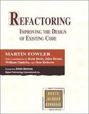
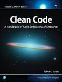

This is my summary of the The Pragmatic Programmer, by Andrew Hunt and David Thomas. I use it while learning and as quick reference. It is not intended to be an standalone substitution of the book so if you really want to learn the concepts here presented, buy and read the book and use this repository as a reference and guide.

If you are the publisher and think this repository should not be public, just write me an email at hugomatilla [at] gmail [dot] com and I will make it private.

Contributions: Issues, comments and pull requests are super welcome 😃
There is a [Quick Reference](#quick-reference) at the end.
# Book List
[Table of Contents of pragmatic programmer](#table-of-contents-of-pragmatic-programmer)
[Table of Contents of Clean Code](#table-of-contents-of-clean-code)

<!-- TOC depthFrom:1 depthTo:6 withLinks:1 updateOnSave:1 orderedList:0 -->
# Table of Contents of pragmatic programmer

- [Chapter 1. A Pragmatic Philosophy](#chapter-1-a-pragmatic-philosophy)
	- [1.-The Cat Ate My Source Code](#1-the-cat-ate-my-source-code)
	- [2.-Software Entropy](#2-software-entropy)
	- [3.-Stone Soup and Boiled Frogs](#3-stone-soup-and-boiled-frogs)
	- [4.-Good enough soup](#4-good-enough-soup)
	- [5.-Your Knowledge Portfolio](#5-your-knowledge-portfolio)
	- [6.-Communicate](#6-communicate)
- [Chapter 2. A Pragmatic Approach](#chapter-2-a-pragmatic-approach)
	- [7.-The Evils of Duplication](#7-the-evils-of-duplication)
	- [8.-Orthogonality](#8-orthogonality)
	- [9.-Reversibility](#9-reversibility)
	- [10-Tracer Bullets](#10-tracer-bullets)
	- [11.-Prototypes and Post-it Notes](#11-prototypes-and-post-it-notes)
	- [12.-Domain Languages](#12-domain-languages)
	- [13.-Estimating](#13-estimating)
- [Chapter 3. The Basic Tools](#chapter-3-the-basic-tools)
	- [14.-The Power of Plain Text](#14-the-power-of-plain-text)
	- [15.-Shell Games](#15-shell-games)
	- [16.-Power Editing](#16-power-editing)
	- [17.-Source Code Control](#17-source-code-control)
	- [18.-Debugging](#18-debugging)
	- [19.-Text Manipulation](#19-text-manipulation)
	- [20.-Code Generators](#20-code-generators)
- [Chapter 4. A Pragmatic Paranoia](#chapter-4-a-pragmatic-paranoia)
	- [21.-Design by Contract](#21-design-by-contract)
	- [22.-Dead Programs Tell No Lies](#22-dead-programs-tell-no-lies)
	- [23.-Assertive Programming](#23-assertive-programming)
	- [24.-When to Use Exceptions](#24-when-to-use-exceptions)
	- [25.-How to Balance Resources](#25-how-to-balance-resources)
- [Chapter 5. Bend or Break](#chapter-5-bend-or-break)
	- [26.-Decoupling and the Law of Demeter](#26-decoupling-and-the-law-of-demeter)
	- [27.-Metaprogramming](#27-metaprogramming)
	- [28.- Temporal Coupling](#28-temporal-coupling)
	- [29.-It's Just a View](#29-its-just-a-view)
	- [30.-Blackboards](#30-blackboards)
- [Chapter 6. While you are coding](#chapter-6-while-you-are-coding)
	- [31.-Program by Coincidence](#31-program-by-coincidence)
	- [32.-Algorithm Speed](#32-algorithm-speed)
	- [33.-Refactoring](#33-refactoring)
	- [34.-Code That's Easy to Test](#34-code-thats-easy-to-test)
	- [35.-Evil Wizards](#35-evil-wizards)
- [Chapter 7. Before the project](#chapter-7-before-the-project)
	- [36.-The Requirements Pit](#36-the-requirements-pit)
	- [37.-Solving Impossible Puzzles](#37-solving-impossible-puzzles)
	- [38.-Not Until You're Ready](#38-not-until-youre-ready)
	- [39.-The Specification Trap](#39-the-specification-trap)
	- [40.-Circles and Arrows](#40-circles-and-arrows)
- [Chapter 8. Pragmatic Projects](#chapter-8-pragmatic-projects)
	- [41.-Pragmatic Teams](#41-pragmatic-teams)
	- [42.-Ubiquitous Automation](#42-ubiquitous-automation)
	- [43.-Ruthless testing](#43-ruthless-testing)
	- [44.-It's All Writing](#44-its-all-writing)
	- [45.- Great Expectations](#45-great-expectations)
- [Quick Reference](#quick-reference)
	- [Tips](#tips)
	- [CheckList](#checklist)
		- [Languages To Learn](#languages-to-learn)
		- [The WISDOM Acrostic](#the-wisdom-acrostic)
		- [How to Maintain Orthogonality](#how-to-maintain-orthogonality)
		- [Things to prototype](#things-to-prototype)
		- [Architectural Questions](#architectural-questions)
		- [Debugging Checklist](#debugging-checklist)
		- [Law of Demeter for Functions](#law-of-demeter-for-functions)
		- [How to Program Deliberately](#how-to-program-deliberately)
		- [When to Refactor](#when-to-refactor)
		- [Cutting the Gordian Knot](#cutting-the-gordian-knot)
		- [Aspects of Testing](#aspects-of-testing)


<!-- /TOC -->
# Clean Code Notes

## Table of contents of Clean Code

- [Chapter 1 - Clean Code](#chapter1)
- [Chapter 2 - Meaningful Names](#chapter2)
- [Chapter 3 - Functions](#chapter3)
- [Chapter 4 - Comments](#chapter4)
- [Chapter 5 - Formatting](#chapter5)
- [Chapter 6 - Objects and Data Structures](#chapter6)
- [Chapter 7 - Error Handling](#chapter7)
- [Chapter 8 - Boundaries](#chapter8)
- [Chapter 9 - Unit Tests](#chapter9)
- [Chapter 10 - Classes](#chapter10)
- [Chapter 11 - Systems](#chapter11)
- [Chapter 12 - Systems](#chapter12)
- [Chapter 13 - Concurrency](#chapter13)
- [Chapter 14 - Successive Refinement](#chapter14)
- [Chapter 15 - JUnit Internals](#chapter15)
- [Chapter 16 - Refactoring SerialDate](#chapter15)
- [Chapter 17 - Smells and Heuristics](#chapter17)


# Chapter 1. A Pragmatic Philosophy
**Tip 1: Care About Your Craft**

Why spend your life developing software unless you care about doing it well?
<br></br>
[Software Craftsmanship](https://manifesto.softwarecraftsmanship.org/)

**Tip 2: Think! About Your Work**

Turn off the autopilot and take control. Constantly critique and appraise your work. Pragmatic programming stems from a philosophy of pragmatic thinking.

## 1.-The Cat Ate My Source Code
**Tip 3: Provide Options, Don't Make Lame Excuses**

Instead of excuses, provide options. Don't say it can't be done; explain what can be done to salvage the situation.
One of the cornerstones of the pragmatic philosophy is the idea of taking responsibility for yourself and your actions in terms of your career advancement, your project, and your day-to-day work.

## 2.-Software Entropy
One broken window, left unrepaired for any substantial length of time, instills in the inhabitants of the building a sense of abandonment—a sense that the powers that be don't care about the building. So another window gets broken. People start littering. Graffiti appears. Serious structural damage begins. In a relatively short space of time, the building becomes damaged beyond the owner's desire to fix it, and the sense of abandonment becomes reality.
[Broken Window Theory](https://www.britannica.com/topic/broken-windows-theory)

**Tip 4: Don't Live with Broken Windows**

Don't mess up the carpet when fixing the broken window.

## 3.-Stone Soup and Boiled Frogs
It's time to bring out the stones. Work out what you can reasonably ask for. Develop it well. Once you've got it, show people, and let them marvel. Then say "of course, it would be better if we added…."

_People find it easier to join an ongoing success._

**Tip 5: Be a Catalyst for Change**

Most software disasters start out too small to notice, and most project overruns happen a day at a time.

If you take a frog and drop it into boiling water, it will jump straight back out again. However, if you place the frog in a pan of cold water, then gradually heat it, the frog won't notice the slow increase in temperature and will stay put until cooked.

Don't be like the frog. Keep an eye on the big picture.

**Tip 6: Remember the Big Picture**

## 4.-Good enough soup
The scope and quality of the system you produce should be specified as part of that system's requirements.

**Tip 7: Make Quality a Requirements Issue**

Great software today is often preferable to perfect software tomorrow. **Know When to Stop**

## 5.-Your Knowledge Portfolio
_An investment in knowledge always pays the best interest._

* Serious investors invest regularly—as a habit.
* Diversification is the key to long-term success.
* Smart investors balance their portfolios between conservative and high-risk,high-reward investments.
* Investors try to buy low and sell high for maximum return.
* Portfolios should be reviewed and rebalanced periodically


### Building Your Portfolio
* Invest regularly 
* Diversify
* Manage risk
* Buy low, sell High
* Review and rebalance

**Tip 8: Invest Regularly in Your Knowledge Portfolio**

### Goals
* Learn at least one new language every year.
* Read a technical book each quarter.
* Read nontechnical books, too.
* Take classes.
* Participate in local user groups.
* Experiment with different environments.
* Stay current.
* Get wired.

[Better skim over to book](https://flylib.com/books/en/1.315.1.18/1/)
<br></br>
You need to ensure that the knowledge in your portfolio is accurate and unswayed by either vendor or media hype.

**Tip 9: Critically Analyze What You Read and Hear**


## 6.-Communicate
* Know what you want to say. Plan what you want to say. Write an outline.
* Know your audience. (WISDOM acrostic)
  * What they **Want**?
  * What is their **Interest**?
  * How **Sophisticated** are they?
  * How much **Detail** they want?
  * Who do you want to **Own** the information?
  * How can you **Motivate** them to listen?
* Choose your moment:  Understanding when your audience needs to hear your information.
* Choose a style:  Just the facts, large bound reports, a simple memo.
* Make it look good: Add good-looking vehicle to your important ideas and engage your audience.
* Involve your audience:  Get their feedback, and pick their brains.
* Be a listener: Encourage people to talk by asking questions.
* Get back to people: Keep people informed afterwards.

**Tip 10: It's Both What You Say and the Way You Say It**

# Chapter 2. A Pragmatic Approach

## 7.-The Evils of Duplication
The problem arises when you need to change a representation of things that are across all the code base.
Every piece of knowledge must have a single, unambiguous, authoritative representation within a system.

**Tip 11: DRY—Don't Repeat Yourself**
<br></br>
[Is Your Code DRY or WET?](https://dzone.com/articles/is-your-code-dry-or-wet)
<br></br>
Types of duplication:

* **Imposed duplication** Developers feel they have no choice—the environment seems to require duplication.
* **Inadvertent duplication** Developers don't realize that they are duplicating information.
* **Impatient duplication** Developers get lazy and duplicate because it seems easier.
* **Interdeveloper duplication** Multiple people on a team (or on different teams) duplicate a piece of information.

**Tip 12: Make it easy to reuse**

## 8.-Orthogonality

Two or more things are orthogonal if changes in one do not affect any of the others. Also called *cohesion*.
Write "shy" code. [Keep it DRY,SHY and Tell the other guy](https://media.pragprog.com/articles/may_04_oo1.pdf)

**Tip 13: Eliminate Effects Between Unrelated Things**

Benefits:

* Gain Productivity
	* Changes are localized
	* Promotes reuse
	* M x N orthogonal components do more than M x N non orthogonal components
* Reduce Risk
	* Diseased sections or code are isolated
	* Are better tested
	* Not tied to a product or platform
* Project Teams: Functionality is divided
* Design: Easier to design a complete project through its components
* Toolkits and Libraries: Choose wisely to keep orthogonality
* Coding: In order to keep orthogonality when adding code do:
	* Keep your code decoupled
	* Avoid  global data
	* Avoid similar functions
* Testing: Orthogonal systems are easier to test.
* Documentation: Also gain quality

## 9.-Reversibility
Be prepared for changes.

**Tip 14: There are no Final Decisions.**

## 10-Tracer Bullets
In new projects your users requirements may be vague. Use of new algorithms, techniques, languages, or libraries unknowns will come. And environment will change over time before you are done.
We're looking for something that gets us from a requirement to some aspect of the final system quickly, visibly, and repeatably.

**Tip 15: Use Tracer Bullets to Find the Target**
<br>
[What is tracer Bullet ? ](http://www.myagilediary.com/tracer-bullet/#:~:text=What%20is%20this%20%E2%80%9CTracer%20Bullet,so%20are%20the%20regular%20bullets.)

Advantages:

* Users get to see something working early
* Developers build a structure to work in
* You have an integration platform
* You have something to demonstrate
* You have a better feel for progress

### Tracer Bullets Don't Always Hit Their Target
Tracer bullets show what you're hitting. This may not always be the target. You then adjust your aim until they're on target. That's the point.


###  Tracer Code versus Prototyping
With a prototype, you're aiming to explore specific aspects of the final system.
Tracer code is used to know how the application as a whole hangs together.

Prototyping generates disposable code.
Tracer code is lean but complete, and forms part of the skeleton of the final system.

## 11.-Prototypes and Post-it Notes
We build software prototypes to analyze and expose risk, and to offer chances for correction at a greatly reduced cost.

Prototype anything that:

* carries risk
* hasn't been tried before
* is absolutely critical to the final system
* is unproven
* is experimental
* is doubtful

Samples:

* Architecture
* New functionality in an existing system
* Structure or contents of external data
* Third-party tools or components
* Performance issues
* User interface design


**Tip 16: Prototype to Learn**


Avoid details:

* Correctness
* Completeness
* Robustness
* Style

Prototyping Architecture:

* Are the responsibilities of the major components well defined and appropriate?
* Are the collaborations between major components well defined?
* Is coupling minimized?
* Can you identify potential sources of duplication?
* Are interface definitions and constraints acceptable?
* Does every module have an access path to the data it needs during execution?

**Never deploy the prototype**

## 12.-Domain Languages

**Tip 17: Program Close to the Problem domain**

## 13.-Estimating
**Tip 18: Estimate to Avoid Surprises**

### How Accurate Is Accurate Enough?
**First:** Do they need high accuracy, or are they looking for a ballpark figure?

**Second:** Scale time estimates properly

| Duration   	| Quote estimate in                    	|
|------------	|--------------------------------------	|
| 1-15 days  	| days                                 	|
| 3-8 weeks  	| weeks                                	|
| 8-30 weeks 	| months                               	|
| 30+ weeks  	| think hard before giving an estimate 	|

### Where Do Estimates Come From?
Ask someone who's been in a similar situation in the past.

* Understand What's Being Asked
* Build a Model of the System
* Break the Model into Components
* Give Each Parameter a Value
* Calculate the Answers
* Keep Track of Your Estimating Prowess

### Estimating Project Schedules
The only way to determine the timetable for a project is by gaining experience on that same project.
Practice incremental development, repeating the following steps:

* Guess estimation
* Check requirements
* Analyze risk
* Design, implement, integrate
* Validate with the users
* Repeat

The refinement and confidence in the schedule gets better and better each iteration
[How to estimate project schedules ? ](https://www.teamgantt.com/guide-to-project-management/how-to-estimate-projects)
<br>
**Tip 19: Iterate the Schedule with the Code**

### What to Say When Asked for an Estimate
**"I'll get back to you."**

### Challenges
Start keeping a log of your estimates. For each, track how accurate you turned out to be. If your error was greater than 50%, try to find out where your estimate went wrong.


# Chapter 3. The Basic Tools
**Tip 20: Keep Knowledge in plain text**

## 14.-The Power of Plain Text

### Drawbacks
* more space
* computationally more expensive

### The Power of Text
* Insurance against obsolescence: you will always have a chance to be able to use text.
* Leverage: Virtually every tool in the computing can operate on plain text.
* Easier testing

## 15.-Shell Games
**Tip 21: Use the power of command Shells**

Can't you do everything equally well by pointing and clicking in a GUI?
**No**. A benefit of GUIs is _WYSIWYG_—what you see is what you get. The disadvantage is _WYSIAYG_—what you see is all you get.

## 16.-Power Editing
**Tip 22: Use a Single Editor Well**

### Editor "must" features
* Configurable
* Extensible
* Programmable
* Syntax highlighting
* Auto-completion
* Auto-indentation
* Initial code or document boilerplate
* Tie-in to help systems
* IDE-like features (compile, debug, and so on)

## 17.-Source Code Control
**Tip 23: Always Use Source Code Control**
<br>
[git github markdown learning place](https://github.com/ErdemOzgen/Git-Github-Markdown-Learning-Archive/blob/master/README.md)

## 18.-Debugging
**Tip 24: Fix the Problem, Not the Blame**

**Tip 25: Don't Panic**

### A Debugging Mindset
Don't waste a single neuron on the train of thought that begins "but that can't happen" because quite clearly it can, and has.
Try to discover the root cause of a problem, not just this particular appearance of it.

### Where to Start
* Before you start, check the warnings or better remove all of them.
* You first need to be accurate in your observations and data.

### Debugging Strategies
#### Bug Reproduction
* The best way to start fixing a bug is to make it reproducible.
* The second best way is to make it reproducible with a _single command_.

#### Visualize Your Data
Use the tools that the debugger offers you. Pen and paper can also help.
#### Tracing
Now what happens before and after.
#### Rubber Ducking
Explain the bug to someone else.
#### Process of Elimination
It is possible that a bug exists in the OS, the compiler, or a third-party product—but this should not be your first thought.

**Tip 26: "select" Isn't Broken**

### The Element of Surprise
**Tip 27: Don't Assume It—Prove It**

### Debugging Checklist
* Is the problem being reported a direct result of the underlying bug, or merely asymptom?
* Is the bug really in the compiler? Is it in the OS? Or is it in your code?
* If you explained this problem in detail to a coworker, what would you say?
* If the suspect code passes its unit tests, are the tests complete enough? What happens if you run the unit test with this data?
* Do the conditions that caused this bug exist anywhere else in the system?
<br>
[Debugging strategies](https://spin.atomicobject.com/2018/08/01/debugging-strategies-tips/)
## 19.-Text Manipulation
**Tip 28: Learn a Text Manipulation Language**
<br>
[python text manipulation](https://docs.python.org/3/library/text.html)

## 20.-Code Generators
**Tip 29: Write Code That Writes Code**
<br>
[TODO for me ](https://medium.com/@BadFoolPrototype/writing-a-simple-code-generator-7af057c58d22) --- [Simple Code Generator](https://youtu.be/fnQYpXc_7TU)
<br>
Two main types of code generators:

* **Passive code generators** are run once to produce a result. They are basically parameterized templates, generating a given output from a set of inputs.
* **Active code generators** are used each time their results are required. Take a single representation of some piece of knowledge and convert it into all the forms your application needs.

### Code Generators Needn't Be Complex
Keep the input format simple, and the code generator becomes simple.

### Code Generators Needn't Generate Code
You can use code generators to write just about any output: HTML, XML, plain text - any text that might be an input somewhere
else in your project.

# Chapter 4. A Pragmatic Paranoia
**Tip 30: You can't write Perfect Software**

No one in the brief history of computing has ever written a piece of perfect software.
Pragmatic Programmers don't trust themselves, either.

## 21.-Design by Contract
A correct program is one that does no more and no less than it claims to do.
Use:

* Preconditions
* Postconditions
* Invariants


**Tip 31: Design with Contracts**

Write "lazy" code: be strict in what you will accept before you begin, and promise as little as possible in return.

### Implementing DBC
Simply enumerating at design time:

* what the input domain range is
* what the boundary conditions are
* what the routine promises to deliver (and what it doesn't)

### Assertions
You can use assertions to apply DBC in some range. (Assertions are not propagated in subclasses)

**DBC enforce Crashing Early**
### Invariants
* Loop Invariants: Is true before and during the loop therefore also when the loop finishes
* Semantic Invariants: ie the error should be on the side of not processing a transaction rather than processing a duplicate transaction.

## 22.-Dead Programs Tell No Lies
All errors give you information. Pragmatic Programmers tell themselves that if there is an error, something very, very bad has happened.

**Tip 32: Crash Early**

`A dead program normally does a lot less damage than a crippled one.`

When your code discovers that something that was supposed to be impossible just happened, your
program is no longer viable.

## 23.-Assertive Programming
**Tip 33: If It Can't Happen, Use Assertions to Ensure That It Won't**

* Assertions are also useful checks on an algorithm's operation.
* Don't use assertions in place of real error handling.
* Leave Assertions Turned On, unless you have critical performance issues.
```java
assert result != null && result.size() > 0 : "Empty result from XYZ"
```
## 24.-When to Use Exceptions
**Tip 34: Use Exceptions for Exceptional Problems**
### What Is Exceptional?
The program must run if all the exception handlers are removed
If your code tries to open a file for reading and that file does not exist, should an exception be raised

* Yes: If the file should have been there
* No: If you have no idea whether the file should exist or not
```java
retcode = OK;
try {
    socket.read(name);
    process(name);
    socket.read(address);
    processAddress(address);
    socket.read(telNo); //  etc, etc... 
} catch (IOException e) {
    retcode = BAD_READ;
    Logger.log("Error reading individual: " + e.getMessage());
}
return retcode;
```
## 25.-How to Balance Resources
When managing resources: memory, transactions, threads, flies, timers—all kinds of things with limited availability, we have to close, finish, delete, deallocate them when we are done.

**Tip 35: Finish What You Start**

### Nest Allocations

* 1.-Deallocate resources in the opposite order to that in which you allocate them
* 2.-When allocating the same set of resources in different places in your code, always allocate them in the same order (prevent deadlocks)

### Objects and Exceptions
Use `finally` to free resources.

# Chapter 5. Bend or Break
## 26.-Decoupling and the Law of Demeter
### Minimize Coupling
Be careful about how many other modules you interact with and how you came to interact with them.

Traversing relationships between objects directly can quickly lead to a combinatorial explosion.

```java

	book.pages().last().text().

	// Instead, we're supposed to go with:

	book.textOfLastPage()
```

Symptoms:

1. Large projects where the command to link a unit test is longer than the test program itself
2. "Simple" changes to one module that propagate through unrelated modules in the system
3. Developers who are afraid to change code because they aren't sure what might be affected

### The Law of Demeter for Functions

The Law of Demeter for functions states that  any method of an object should call only methods  belonging to:

```js

class Demeter {
	private A a;
	void m(B b) {
		a.hello(); 							//itself
		b.hello(); 							//any parameters that were passed to the method
		new Z().hello(); 					// any object it created
		Singleton.INSTANCE.hello(); 		// any directly held component
	}
}
```

**Tip 36: Minimize Coupling Between Modules**

### Does It Really Make a Difference?
Using The Law of Demeter will make your code more adaptable and robust, but at a cost:
you will be writing a large number of wrapper methods that simply forward the request on to a delegate. imposing both a runtime cost and a space overhead.
Balance the pros and cons for your particular application.

## 27.-Metaprogramming
"Out with the details!" Get them out of the code. While we're at it, we can make our code highly configurable and "soft"—that is, easily adaptable to changes.
[-> Metaprograming](https://cs.lmu.edu/~ray/notes/metaprogramming/)
### Dynamic Configuration
**Tip 37: Configure, Don't Integrate**
### Metadata-Driven Applications
We want to configure and drive the application via metadata as much as possible.
_Program for the general case, and put the specifics somewhere else —outside the compiled code base_

**Tip 38: Put Abstractions in Code Details in Metadata**

Benefits:

* It forces you to decouple your design, which results in a more flexible and adaptable program.
* It forces you to create a more robust, abstract design by deferring details—deferring them all the way out of the program.
* You can customize the application without recompiling it.
* Metadata can be expressed in a manner that's much closer to the problem domain than a general-purpose programming language might be.
* You may even be able to implement several different projects using the same application engine, but with different metadata.

### When to Configure
A flexible approach is to write programs that can reload their configuration while they're running.

* long-running server process:  provide some way to reread and apply metadata while the program is running.
* small client GUI application: if restarts quickly no problem.

## 28.- Temporal Coupling
Two aspects of time:

* Concurrency: things happening at the same time
* Ordering: the relative positions of things in time

We need to allow for concurrency and to think about decoupling any time or order dependencies.
Reduce any time-based dependencies

### Workflow

Use [activity diagrams](https://upload.wikimedia.org/wikipedia/commons/thumb/e/e7/Activity_conducting.svg/2000px-Activity_conducting.svg.png) to maximize parallelism by identifying activities that could be performed in parallel, but aren't.

**Tip 39: Analyze Workflow to Improve Concurrency**

### Architecture
Balance load among multiple consumer processes: **the hungry consumer model.**

In a hungry consumer model, you replace the central scheduler with a number of independent consumer tasks and a centralized work queue. Each consumer task grabs a piece from the work queue and goes on about the business of processing it. As each task finishes its work, it goes back to the queue for some more. This way, if any particular task gets bogged down, the others can pick up the slack, and each individual component can proceed at its own pace. Each component is temporally decoupled from the others.

**Tip 40: Design Using Services**

### Design for Concurrency
Programming with threads imposes some design constraints—and that's a good thing.

* Global or static variables must be protected from concurrent access
* Check if you need a global variable in the first place.
* Consistent state information, regardless of the order of calls
* Objects must always be in a valid state when called, and they can be called at the most awkward times. Use class invariants, discussed in Design by Contract.

### Cleaner Interfaces
Thinking about concurrency and time-ordered dependencies can lead you to design cleaner interfaces as well.

**Tip 41: Always Design for Concurrency**

### Deployment
You can be flexible as to how the application is deployed: standalone, client-server, or n-tier.

If we design to allow for concurrency, we can more easily meet scalability or performance requirements when the time comes—and if the time never comes, we still have the benefit of a cleaner design.

## 29.-It's Just a View
### Publish/Subscribe
Objects should be able to register to receive only the events they need, and should never be sent events they don't need.

Use this publish/subscribe mechanism to implement a very important design concept: the separation of a model from views of the model.

### Model-View-Controller
Separates the model from both the GUI that represents it and the controls that manage the view.

Advantage:

* Support multiple views of the same data model.
* Use common viewers on many different data models.
* Support multiple controllers to provide nontraditional input mechanisms.

**Tip 42: Separate Views from Models**
### Beyond GUIs
The controller is more of a coordination mechanism, and doesn't have to be related to any sort of input device.

* **Model** The abstract data model representing the target object. The model has no direct knowledge of any views or controllers.
* **View** A way to interpret the model. It subscribes to changes in the model and logical events from the controller.
* **Controller** A way to control the view and provide the model with new data. It publishes events to both the model and the view.
[MVC explained](https://www.tutorialspoint.com/mvc_framework/index.htm) &
[WTF is MVC ?](https://medium.com/@blakeschlin/what-the-f-k-is-mvc-explained-with-real-world-analogy-e088a9a8b787)

## 30.-Blackboards
A blackboard system lets us decouple our objects from each other completely, providing a forum where knowledge consumers and producers can exchange data anonymously and asynchronously.
### Blackboard Implementations
With Blackboard systems, you can store active objects—not just data—on the blackboard, and retrieve them by partial matching of fields (via templates and wildcards) or by subtypes.

Functions that a Blackboard system should have:

* **read** Search for and retrieve data from the space.
* **write** Put an item into the space.
* **take** Similar to read, but removes the item from the space as well.
* **notify** Set up a notification to occur whenever an object is written that matches the template.

Organizing Your Blackboard by partitioning it when working on large cases.
<br>
[blackboard learning ](https://en.wikipedia.org/wiki/Blackboard_system)

**Tip 43: Use Blackboards to Coordinate Workflow**

# Chapter 6. While you are coding
## 31.-Program by Coincidence
We should avoid programming by coincidence—relying on luck and accidental successes— in favor of programming deliberately.
**Tip 44: Don't Program by Coincidence**

### How to Program Deliberately
* Always be aware of what you are doing.
* Don't code blindfolded.
* Proceed from a plan.
* Rely only on reliable things.
* Document your assumptions. [Design by Contract](#21-design-by-contract).
* Don't just test your code, but test your assumptions as well. Don't guess [Assertive Programming](#23-assertive-programming)
* Prioritize your effort.
* Don't be a slave to history. Don't let existing code dictate future code. [Refactoring](#33-refactoring)

## 32.-Algorithm Speed
Pragmatic Programmers estimate the resources that algorithms use—time, processor, memory, and so on.

### Use: Big O Notation
* **O(1)**: Constant (access element in array, simple statements)
[Big o](https://youtu.be/D6xkbGLQesk)
```js
	bool IsFirstElementNull(IList<string> elements)
	{
    	return elements[0] == null;
	}
```

* **O(lg(n))**: Logarithmic (binary search) lg(n) = lg2(n)

```js

	Int BinarySearch(list, target)
	{
	   lo = 1, hi = size(list)
	   while (lo <= hi){
	      mid = lo + (hi-lo)/2
	      if (list[mid] == target) return mid
	      else if (list[mid] < target) lo = mid+1
	      else hi = mid-1
	   }
	}

```

* **O(n)**: Linear: Sequential search

```js

	bool ContainsValue(IList<string> elements, string value)
	{
	    foreach (var element in elements)
	    {
	        if (element == value) return true;
	    }

	    return false;
	}

```
* **O(n lg(n))**: Worse than linear but not much worse(average runtime of quickshort, headsort)
* **O(n²)**: Square law (selection and insertion sorts)

```js

	bool ContainsDuplicates(IList<string> elements)
	{
	    for (var outer = 0; outer < elements.Count; outer++)
	    {
	        for (var inner = 0; inner < elements.Count; inner++)
	        {
	            // Don't compare with self
	            if (outer == inner) continue;

	            if (elements[outer] == elements[inner]) return true;
	        }
	    }

	    return false;
	}

```
* **O(n³)**: Cubic (multiplication of 2 n x n matrices)
* **O(Cⁿ)**: Exponential (travelling salesman problem, set partitioning)

```js

	int Fibonacci(int number)
	{
	    if (number <= 1) return number;

	    return Fibonacci(number - 2) + Fibonacci(number - 1);
	}
```

### Common Sense Estimation
* Simple loops: O(n)
* Nested loops: O(n²)
* Binary chop: O(lg(n))
* Divide and conquer: O(n lg(n)). Algorithms that partition their input, work on the two halves independently, and then combine the result.
* Combinatoric: O(Cⁿ)


**Tip 45: Estimate the Order of Your Algorithms**

**Tip 46: Test Your Estimates**

### Best Isn't Always Best
Be pragmatic about choosing appropriate algorithms—the fastest one is not always the best for the job.

Be wary of premature optimization. Make sure an algorithm really is a bottleneck before investing time improving it.

## 33.-Refactoring
Code needs to evolve; it's not a static thing.

### When Should You Refactor?
* Duplication. You've discovered a violation of the DRY principle ([The Evils of Duplication](#7-the-evils-of-duplication)).
* Nonorthogonal design. You've discovered some code or design that could be made more orthogonal ([Orthogonality](#8-orthogonality)).
* Outdated knowledge. Things change, requirements drift, and your knowledge of the problem increases. Code needs to keep up.
* Performance. You need to move functionality from one area of the system to another to improve performance.

**Tip 47: Refactor Early, Refactor Often**

### How Do You Refactor?
* 1. Don't try to refactor and add functionality at the same time.
* 2. Make sure you have good tests before you begin refactoring.
* 3. Take short, deliberate steps.

## 34.-Code That's Easy to Test
Build testability into the software from the very beginning, and test each piece thoroughly before trying to wire them together.

### Unit Testing
Testing done on each module, in isolation, to verify its behavior.
A software unit test is code that exercises a module.

### Testing Against Contract
This will tell us two things:

1. Whether the code meet the contract
2. Whether the contract means what we think it means.

**Tip 48: Design to Test**

There's no better way to fix errors than by avoiding them in the first place.
Build the tests before you implement the code.

### Writing Unit Tests
By making the test code readily accessible, you are providing developers who may use your code with two invaluable resources:

1. Examples of how to use all the functionality of your module
2. A means to build regression tests to validate any future changes to the code

You must run them, and run them often.

### Using Test Harnesses
Test harnesses should include the following capabilities:

* A standard way to specify setup and cleanup
* A method for selecting individual tests or all available tests
* A means of analyzing output for expected (or unexpected) results
* A standardized form of failure reporting

### Build a Test Window

* Log files.
* Hot-key sequence.
* Built-in Web server.

### A Culture of Testing

**Tip 49: Test Your Software, or Your Users Will**

## 35.-Evil Wizards
If you do use a wizard, and you don't understand all the code that it produces, you won't be in control of your own application.

**Tip 50: Don't Use Wizard Code You Don't Understand**

# Chapter 7. Before the project

## 36.-The Requirements Pit
_Perfection is achieved, not when there is nothing left to add, but when there is nothing left to take away…._

**Tip 51: Don't Gather Requirements—Dig for Them**

### Digging for Requirements
Policy may end up as metadata in the application.

Gathering requirements in this way naturally leads you to a system that is well factored to support metadata.

**Tip 52: Work with a User to Think Like a User**

### Documenting Requirements
Use "use cases"

### Overspecifying
Requirements are not architecture. Requirements are not design, nor are they the user interface. Requirements are need.

### Seeing Further
**Tip 53: Abstractions Live Longer than Details**

### Just One More Wafer-Thin Mint…
What can we do to prevent requirements from creeping up on us?

The key to managing growth of requirements is to point out each new feature's impact on the schedule 	to the project sponsors.

### Maintain a Glossary
It's very hard to succeed on a project where the users and developers refer to the same thing by different names or, even worse, refer to different things by the same name.

**Tip 54: Use a Project Glossary**

### Get the Word Out
Publishing project documents to internal Web sites for easy access by all participants.

## 37.-Solving Impossible Puzzles
### Degrees of Freedom
The key to solving puzzles is both to recognize the constraints placed on you and to recognize the degrees of freedom you do have, for in those you'll find your solution.

**Tip 55: Don't Think Outside the Box—Find the Box**

### There Must Be an Easier Way!
If you can not find the solution, step back and ask yourself these questions:

* Is there an easier way?
* Are you trying to solve the right problem, or have you been distracted by a peripheral technicality?
* Why is this thing a problem?
* What is it that's making it so hard to solve?
* Does it have to be done this way?
* Does it have to be done at all?

## 38.-Not Until You're Ready
If you sit down to start typing and there's some nagging doubt in your mind, heed it.

**Tip 56: Listen to Nagging Doubts—Start When You're Ready**

### Good Judgment or Procrastination?
Start prototyping. Choose an area that you feel will be difficult and begin producing some kind of proof of concept, and be sure to remember
why you're doing it and that it is a prototype.

## 39.-The Specification Trap
Writing a specification is quite a responsibility.

You should know when to stop:

* Specification will never capture every detail of a system or its requirement.
* The expressive power of language itself might not be enough to describe a specification
* A design that leaves the coder no room for interpretation robs the programming effort of any skill and art.

**Tip 57: Some Things Are Better Done than Described**

## 40.-Circles and Arrows

**Tip 58: Don't Be a Slave to Formal Methods**

Formal methods have some serious shortcomings:

* Diagrams are meaningless to the end users, show the user a prototype and let them play with it.
* Formal methods seem to encourage specialization. It may not be possible to have an in-depth grasp of every aspect of a system.
* We like to write adaptable, dynamic systems, using metadata to allow us to change the character of applications at runtime, but most current formal methods don't allow it.

### Do Methods Pay Off?
Never underestimate the cost of adopting new tools and methods.

### Should We Use Formal Methods?
Absolutely but remember that is just one more tool in the toolbox.

**Tip 59: Expensive Tools Do Not Produce Better Designs**

# Chapter 8. Pragmatic Projects

## 41.-Pragmatic Teams
Pragmatic techniques that help an individual can work for teams.

### No Broken Windows
Quality is a team issue.

Teams as a whole should not tolerate broken windows—those small imperfections that no one fixes.

Quality can come only from the individual contributions of all team members.

### Boiled Frogs
People assume that someone else is handling an issue, or that the team leader must have OK'd a change that your user is requesting. Fight this.

### Communicate
The team as an entity needs to communicate clearly with the rest of the world.

People look forward to meetings with them, because they know that they'll see a well-prepared performance that makes everyone feel good.

There is a simple marketing trick that helps teams communicate as one: generate a brand.

### Don't Repeat Yourself
Appoint a member as the project librarian.

### Orthogonality
It is a mistake to think that the activities of a project—analysis, design, coding, and testing—can happen in isolation. They can't. These are different views of the same problem, and artificially separating them can cause a boatload of trouble.

**Tip 60: Organize Around Functionality, Not Job Functions**

* Split teams by functionally. Database, UI, API
* Let the teams organize themselves internally
* Each team has responsibilities to others in the project (defined by their agreed-upon commitments)
* We're looking for cohesive, largely self-contained teams of people

Organize our resources using the same techniques we use to organize code, using techniques such as contracts (Design by Contract), decoupling (Decoupling and the Law of Demeter), and orthogonality (Orthogonality), and we help isolate the team as a whole from the effects of change.

### Automation
Automation is an essential component of every project team

### Know When to Stop Adding Paint

## 42.-Ubiquitous Automation
### All on Automatic
**Tip 61: Don't Use Manual Procedures**

Using _cron_, we can schedule backups, nightly build, Web site... unattended, automatically.

### Compiling the Project
We want to check out, build, test, and ship with a single command

* Generating Code
* Regression Tests

### Build Automation
A build is a procedure that takes an empty directory (and a known compilation environment) and builds the project from scratch, producing whatever you hope to produce as a final deliverable.

* 1. Check out the source code from the repository
* 2. Build the project from scratch (marked with the version number).
* 3. Create a distributable image
* 4. Run specified tests

When you don't run tests regularly, you may discover that the application broke due to a code change made three months ago. Good luck finding that one.

**Nightly build** run it every night.

**Final builds** (to ship as products), may have different requirements from the regular nightly build.

### Automatic Administrivia
Our goal is to maintain an automatic, unattended, content-driven workflow.

* Web Site Generation results of the build itself, regression tests, performance statistics, coding metrics...
* Approval Procedures get marks `/* Status: needs_review */`,  send email...

### The Cobbler's Children
Let the computer do the repetitious, the mundane—it will do a better job of it than we would. We've got more important and more difficult things to do.
## 43.-Ruthless testing
Pragmatic Programmers are driven to find our bugs now, so we don't have to endure the shame of others finding our bugs later.

**Tip 62: Test Early. Test Often. Test Automatically.**

Tests that run with every build are the most effective.

The earlier a bug is found, the cheaper it is to remedy. "Code a little, test a little".

**Tip 63: Coding Ain't Done til All the Tests Run**

### 3 Main aspects:

#### 1.-What to Test

* Unit testing: code that exercises a module.
* Integration testing: the major subsystems that make up the project work and play well with each other.
* Validation and verification: test if you are delivering what users needs.
* Resource exhaustion, errors, and recovery: discover how it will behave under real-world conditions. (Memory, Disk, CPU, Screen...)
* Performance testing: meets the performance requirements under real-world conditions.
* Usability testing: performed with real users, under real environmental conditions.

#### 2.-How to Test

* Regression testing: compares the output of the current test with previous (or known) values. Most of the tests are regression tests.
* Test data: there are only two kinds of data: real-world data and synthetic data.
* Exercising GUI systems: requires specialized testing tools, based on a simple event capture/playback model.
* Testing the tests: After you have written a test to detect a particular bug, cause the bug deliberately and make sure the test complains.
	
**Tip 64: Use Saboteurs to Test Your Testing**
* Testing thoroughly:

**Tip 65: Test State Coverage, Not Code Coverage**

#### 3.-When to Test
As soon as any production code exists, it needs to be tested.
Most testing should be done automatically.

### Tightening the Net
If a bug slips through the net of existing tests, you need to add a new test to trap it next time.

**Tip 66: Find Bugs Once**

## 44.-It's All Writing
If there's a discrepancy, the code is what matters—for better or worse.

**Tip 67: Treat English as Just Another Programming Language**

**Tip 68: Build Documentation In, Don't Bolt It On**

### Comments in Code
In general, comments should discuss why something is done, its purpose and its goal.

Remember that you (and others after you) will be reading the code many hundreds of times, but only writing it a few times.

Even worse than meaningless names are misleading names.

One of the most important pieces of information that should appear in the source file is the author's name—not necessarily who edited the file last, but the owner.

### Executable Documents
Create documents that create schemas. The only way to change the schema is to change the document.

### Technical Writers
We want the writers to embrace the same basic principles that a Pragmatic Programmer does—especially honoring the DRY principle, orthogonality, the model-view concept, and the use of automation and scripting.

### Print It or Weave It
Paper documentation can become out of date as soon as it's printed.

Publish it online, on the Web.

Remember to put a date stamp or version number on each Web page.

Using a markup system, you have the flexibility to implement as many different output formats as you need.

### Markup Languages
Documentation and code are different views of the same underlying model, but the view is all that should be different.

##  45.-Great Expectations
The success of a project is measured by how well it meets the expectations of its users.

**Tip 69: Gently Exceed Your Users' Expectations**

### Communicating Expectations
Users initially come to you with some vision of what they want. You cannot just ignore it.

Everyone should understand what's expected and how it will be built.

### The Extra Mile
Give users that little bit more than they were expecting.

* Balloon or ToolTip help
* Keyboard shortcuts
* A quick reference guide as a supplement to the user's manual
* Colorization
* Log file analyzers
* Automated installation
* Tools for checking the integrity of the system
* The ability to run multiple versions of the system for training
* A splash screen customized for their organization

### Pride and Prejudice
Pragmatic Programmers don't shirk from responsibility. Instead, we rejoice in accepting challenges and in making our expertise well known.

We want to see pride of ownership. "I wrote this, and I stand behind my work."

**Tip 70: Sign Your Work**


# Quick Reference
## Tips
**Tip 1: Care About Your Craft**
Why spend your life developing software unless you care about doing it well?

**Tip 2: Think! About Your Work**
Turn off the autopilot and take control. Constantly critique and appraise your work.

**Tip 3: Provide Options, Don't Make Lame Excuses**
Instead of excuses, provide options. Don't say it can't be done; explain what can be done.

**Tip 4: Don't Live with Broken Windows**
Fix bad designs, wrong decisions, and poor code when you see them.

**Tip 5: Be a Catalyst for Change**
You can't force change on people. Instead, show them how the future might be and help them participate in creating it.

**Tip 6: Remember the Big Picture**
Don't get so engrossed in the details that you forget to check what's happening around you.

**Tip 7: Make Quality a Requirements Issue**
Involve your users in determining the project's real quality requirements.

**Tip 8: Invest Regularly in Your Knowledge Portfolio**
Make learning a habit.

**Tip 9: Critically Analyze What You Read and Hear**
Don't be swayed by vendors, media hype, or dogma. Analyze information in terms of you and your project.

**Tip 10: It's Both What You Say and the Way You Say It**
There's no point in having great ideas if you don't communicate them effectively.

**Tip 11: DRY – Don't Repeat Yourself**
Every piece of knowledge must have a single, unambiguous, authoritative representation within a system.

**Tip 12: Make It Easy to Reuse**
If it's easy to reuse, people will. Create an environment that supports reuse.

**Tip 13: Eliminate Effects Between Unrelated Things**
Design components that are self-contained, independent, and have a single, well-defined purpose.

**Tip 14: There Are No Final Decisions**
No decision is cast in stone. Instead, consider each as being written in the sand at the beach, and plan for change.

**Tip 15: Use Tracer Bullets to Find the Target**
Tracer bullets let you home in on your target by trying things and seeing how close they land.

**Tip 12: Prototype to Learn**
Prototyping is a learning experience. Its value lies not in the code you produce, but in the lessons you learn.

**Tip 17: Program Close to the Problem Domain**
Design and code in your user's language.

**Tip 18: Estimate to Avoid Surprises**
Estimate before you start. You'll spot potential problems up front.

**Tip 19: Iterate the Schedule with the Code**
Use experience you gain as you implement to refine the project time scales.

**Tip 20: Keep Knowledge in Plain Text**
Plain text won't become obsolete. It helps leverage your work and simplifies debugging and testing.

**Tip 21: Use the Power of Command Shells**
Use the shell when graphical user interfaces don't cut it.

**Tip 22: Use a Single Editor Well**
The editor should be an extension of your hand; make sure your editor is configurable, extensible, and programmable.

**Tip 23: Always Use Source Code Control**
Source code control is a time machine for your work – you can go back.

**Tip 24: Fix the Problem, Not the Blame**
It doesn't really matter whether the bug is your fault or someone else's – it is still your problem, and it still needs to be fixed.

**Tip 25: Don't Panic When Debugging**
Take a deep breath and THINK! about what could be causing the bug.

**Tip 26: "select" Isn't Broken.**
It is rare to find a bug in the OS or the compiler, or even a third-party product or library. The bug is most likely in the application.

**Tip 27: Don't Assume It – Prove It**
Prove your assumptions in the actual environment – with real data and boundary conditions.

**Tip 28: Learn a Text Manipulation Language.**
You spend a large part of each day working with text. Why not have the computer do some of it for you?

**Tip 29: Write Code That Writes Code**
Code generators increase your productivity and help avoid duplication.

**Tip 30: You Can't Write Perfect Software**
Software can't be perfect. Protect your code and users from the inevitable errors.

**Tip 31: Design with Contracts**
Use contracts to document and verify that code does no more and no less than it claims to do.

**Tip 32: Crash Early**
A dead program normally does a lot less damage than a crippled one.

**Tip 33: Use Assertions to Prevent the Impossible**
Assertions validate your assumptions. Use them to protect your code from an uncertain world.

**Tip 34: Use Exceptions for Exceptional Problems**
Exceptions can suffer from all the readability and maintainability problems of classic spaghetti code. Reserve exceptions for exceptional things.

**Tip 35: Finish What You Start**
Where possible, the routine or object that allocates a resource should be responsible for deallocating it.

**Tip 36: Minimize Coupling Between Modules**
Avoid coupling by writing "shy" code and applying the Law of Demeter.

**Tip 37: Configure, Don't Integrate**
Implement technology choices for an application as configuration options, not through integration or engineering.

**Tip 38: Put Abstractions in Code, Details in Metadata**
Program for the general case, and put the specifics outside the compiled code base.

**Tip 39: Analyze Workflow to Improve Concurrency**
Exploit concurrency in your user's workflow.

**Tip 40: Design Using Services**
Design in terms of services – independent, concurrent objects behind well-defined, consistent interfaces.

**Tip 41: Always Design for Concurrency**
Allow for concurrency, and you'll design cleaner interfaces with fewer assumptions.

**Tip 42: Separate Views from Models**
Gain flexibility at low cost by designing your application in terms of models and views.

**Tip 43: Use Blackboards to Coordinate Workflow**
Use blackboards to coordinate disparate facts and agents, while maintaining independence and isolation among participants.

**Tip 44: Don't Program by Coincidence**
Rely only on reliable things. Beware of accidental complexity, and don't confuse a happy coincidence with a purposeful plan.

**Tip 45: Estimate the Order of Your Algorithms**
Get a feel for how long things are likely to take before you write code.

**Tip 46: Test Your Estimates**
Mathematical analysis of algorithms doesn't tell you everything. Try timing your code in its target environment.

**Tip 47: Refactor Early, Refactor Often**
Just as you might weed and rearrange a garden, rewrite, rework, and re-architect code when it needs it. Fix the root of the problem.

**Tip 48: Design to Test**
Start thinking about testing before you write a line of code.

**Tip 49: Test Your Software, or Your Users Will**
Test ruthlessly. Don't make your users find bugs for you.

**Tip 50: Don't Use Wizard Code You Don't Understand**
Wizards can generate reams of code. Make sure you understand all of it before you incorporate it into your project.

**Tip 51: Don't Gather Requirements – Dig for Them**
Requirements rarely lie on the surface. They're buried deep beneath layers of assumptions, misconceptions, and politics.

**Tip 52: Work With a User to Think Like a User**
It's the best way to gain insight into how the system will really be used.

**Tip 53: Abstractions Live Longer than Details**
Invest in the abstraction, not the implementation. Abstractions can survive the barrage of changes from different implementations and new technologies.

**Tip 54: Use a Project Glossary**
Create and maintain a single source of all the specific terms and vocabulary for a project.

**Tip 55: Don't Think Outside the Box – Find the Box**
When faced with an impossible problem, identify the real constraints. Ask yourself: "Does it have to be done this way? Does it have to be done at all?"

**Tip 56: Start When You're Ready.**
You've been building experience all your life. Don't ignore niggling doubts.

**Tip 57: Some Things Are Better Done than Described**
Don't fall into the specification spiral – at some point you need to start coding.

**Tip 58: Don't Be a Slave to Formal Methods.**
Don't blindly adopt any technique without putting it into the context of your development practices and capabilities.

**Tip 59: Costly Tools Don't Produce Better Designs**
Beware of vendor hype, industry dogma, and the aura of the price tag. Judge tools on their merits.

**Tip 60: Organize Teams Around Functionality**
Don't separate designers from coders, testers from data modelers. Build teams the way you build code.

**Tip 61: Don't Use Manual Procedures**
A shell script or batch file will execute the same instructions, in the same order, time after time.

**Tip 62: Test Early. Test Often. Test Automatically**
Tests that run with every build are much more effective than test plans that sit on a shelf.

**Tip 63: Coding Ain't Done 'Til All the Tests Run**
'Nuff said.

**Tip 64: Use Saboteurs to Test Your Testing**
Introduce bugs on purpose in a separate copy of the source to verify that testing will catch them.

**Tip 65: Test State Coverage, Not Code Coverage**
Identify and test significant program states. Just testing lines of code isn't enough.

**Tip 66: Find Bugs Once**
Once a human tester finds a bug, it should be the last time a human tester finds that bug. Automatic tests should check for it from then on.

**Tip 67: English is Just a Programming Language**
Write documents as you would write code: honor the DRY principle, use metadata, MVC, automatic generation, and so on.

**Tip 68: Build Documentation In, Don't Bolt It On**
Documentation created separately from code is less likely to be correct and up to date.

**Tip 69: Gently Exceed Your Users' Expectations**
Come to understand your users' expectations, then deliver just that little bit more.

**Tip 70: Sign Your Work**
Craftsmen of an earlier age were proud to sign their work. You should be, too.

## CheckList

### Languages To Learn
Tired of C, C++, and Java? Try the following languages. Each of these languages has different capabilities and a different "flavor." Try a small project at home using one or more of them.
- CLOS
- Dylan
- Eiffel
- Objective C
- Prolog
- Smalltalk
- TOM

### The WISDOM Acrostic
- **W**hat do you want them to learn?
- What **i**s their interest in what you've got to say?
- How **s**ophisticated are they?
- How much **d**etail do they want?
- Whom do you want to **o**wn the information?
- How can you **m**otivate them to listen to you?
 
### How to Maintain Orthogonality
- Design independent, well-defined components.
- Keep your code decoupled.
- Avoid global data.
- Refactor similar functions.

### Things to prototype
- Architecture
- New functionality in an existing system
- Structure or contents of external data
- Third-party tools or components
- Performance issues
- User interface design

### Architectural Questions
- Are responsibilities well defined?
- Are the collaborations well defined?
- Is coupling minimized?
- Can you identify potential duplication?
- Are interface definitions and constraints acceptable?
- Can modules access needed data – when needed?

### Debugging Checklist
- Is the problem being reported a direct result of the underlying bug, or merely a symptom?
- Is the bug really in the compiler? Is it in the OS? Or is it in your code?
- If you explained this problem in detail to a coworker, what would you say?
- If the suspect code passes its unit tests, are the tests complete enough? What happens if you run the unit test with this data?
- Do the conditions that caused this bug exist anywhere else in the system?

### Law of Demeter for Functions
An object's method should call only methods belonging to:

- Itself
- Any parameters passed in
- Objects it creates
- Component objects

### How to Program Deliberately
- Stay aware of what you're doing.
- Don't code blindfolded.
- Proceed from a plan.
- Rely only on reliable things.
- Document your assumptions.
- Test assumptions as well as code.
- Prioritize your effort.
- Don't be a slave to history.

### When to Refactor
- You discover a violation of the DRY principle.
- You find things that could be more orthogonal.
- Your knowledge improves.
- The requirements evolve.
- You need to improve performance.

### Cutting the Gordian Knot
When solving _impossible_ problems, ask yourself:

- Is there an easier way?
- Am I solving the right problem?
- Why is this a problem?
- What makes it hard?
- Do I have to do it this way?
- Does it have to be done at all?

### Aspects of Testing
- Unit testing
- Integration testing
- Validation and verification
- Resource exhaustion, errors, and recovery
- Performance testing
- Usability testing
- Testing the tests themselves

Content from The Pragmatic Programmer, by Andrew Hunt and David Thomas. Visit [www.pragmaticprogrammer.com](http://www.pragmaticprogrammer.com).
Copyright 2000 by Addison Wesley Longman, Inc.


<a name="chapter1">
<h1>Chapter 1 -  Clean Code</h1>
</a>
This Book is about good programming. It's about how to write good code, and how to transform bad code into good code.

The code represents the detail of the requirements and the details cannot be ignored or abstracted. We may create languages that are closer to the requirements. We can create tools that help us parse and assemble those requirements into formal structures. But we will never eliminate necessary precision.

### Why write bad code?

- Are you in a rush?
- Do you try to go "fast"?
- Do not you have time to do a good job?
- Are you tired of work in the same program/module?
- Does your Boss push you to finish soon?

The previous arguments could create a swamp of senseless code.

If you say "I will back to fix it later" you could fall in the [LeBlanc's law](https://en.wikipedia.org/wiki/Talk%3AList_of_eponymous_laws#Proposal_to_add_LeBlanc.27s_law) "Later equals never"

You are a professional and the code is your responsibility. Let's analyze the following anecdote:

> What if you were a doctor and had a patient who demanded that you stop all the silly hand-washing in preparation for surgery because it was taking too much time? Clearly the patient is the boss; and yet the doctor should absolutely refuse to comply. Why? Because the doctor knows more than the patient about the risks of disease and infection. It would be unprofessional (never mind criminal) for the doctor to comply with the patient.

So too it is unprofessional for programmers to bend to the will of managers who don’t understand the risks of making messes.

Maybe sometime you think in go fast to make the deadline. The only way to go fast is to keep the code as clean as possible at all times.

### What is Clean Code?

Each experimented programmer has his/her own definition of clean code, but something is clear, a clean code is a code that you can read easily. The clean code is code that has been taken care of.

In his book Uncle Bob says the next:

> Consider this book a description of the Object Mentor School of Clean Code. The techniques and teachings within are the way that we practice our art. We are willing to claim that if you follow these teachings, you will enjoy the benefits that we have enjoyed, and you will learn to write code that is clean and professional. But don’t make the mistake of thinking that we are somehow “right” in any absolute sense. There are other schools and other masters that have just as much claim to professionalism as we. It would behoove you to learn from them as well.

### The boy Scout Rule

It’s not enough to write the code well. The code has to be kept clean over time. We have all seen code rot and degrade as time passes. So we must take an active role in preventing this degradation.

It's a good practice apply the [Boy Scout Rule](http://programmer.97things.oreilly.com/wiki/index.php/The_Boy_Scout_Rule)

> Always leave the campground cleaner than you found it.

<a name="chapter2">
<h1>Chapter 2 -  Meaningful Names</h1>
</a>

Names are everywhere in software. Files, directories, variables functions, etc. Because we do so much of it. We have better do it well.

### Use Intention-Revealing Names

It is easy to say that names reveal intent. Choosing good names takes time, but saves more than it takes. So take care with your names and change them when you find better ones.

The name of a variable, function or class, should answer all the big questions. It should tell you why it exists, what it does, and how is used. **If a name requires a comment, then the name does not reveals its intent**.

| Does not reveals intention       | Reveals intention       |
| -------------------------------- | ----------------------- |
| `int d; // elapsed time in days` | `int elapsedTimeInDays` |

Choosing names that reveal intent can make much easier to understand and change code. Example:

```java
public List<int[]> getThem() {
  List<int[]> list1 = new ArrayList<int[]>();
  for (int[] x : theList)
    if (x[0] == 4)
      list1.add(x);
  return list1;
}
```

This code is simple, but create many questions:

1. What is the content of `theList`?
2. What is the significance of the item `x[0]` in the list?.
3. Why we compare `x[0]` vs `4`?
4. How would i use the returned list?

The answers to these questions are not present in the code sample, but they could have been. Say that we’re working in a mine sweeper game. We can refactor the previous code as follows:

```java
public List<int[]> getFlaggedCells() {
  List<int[]> flaggedCells = new ArrayList<int[]>();
  for (int[] cell : gameBoard)
    if (cell[STATUS_VALUE] == FLAGGED)
      flaggedCells.add(cell);
  return flaggedCells;
}
```

Now we know the next information:

1. `theList` represents the `gameBoard`
2. `x[0]` represents a cell in the board and `4` represents a flagged cell
3. The returned list represents the `flaggedCells`

Notice that the simplicity of the code has not changed. It still has exactly the same number of operators and constants, with exactly the same number of nesting levels. But the code has become much more explicit.

We can improve the code writing a simple class for cells instead of using an array of `ints`. It can include an **intention-revealing function** (called it `isFlagged`) to hide the magic numbers. It results in a new function of the function.

```java
public List<Cell> getFlaggedCells() {
  List<Cell> flaggedCells = new ArrayList<Cell>();
  for (Cell cell : gameBoard)
    if (cell.isFlagged())
      flaggedCells.add(cell);
  return flaggedCells;
}
```

### Avoid Disinformation

Programmers must avoid leaving false clues that obscure the meaning of code. We should avoid words whose entrenched meaning vary from our intended meaning.

Do not refer to a grouping of accounts as an `accountList` unless it's actually a `List`. The word `List` means something specific to programmers. If the container holding the accounts is not actually a List, it may lead to false conclusions. So `accountGroup` or `bunchOfAccounts` or just plain `accounts` would be better.

Beware of using names which vary in small ways. How long does it take to spot the subtle difference between a `XYZControllerForEfficientHandlingOfStrings` in one module and, somewhere a little more distant, `XYZControllerForEfficientStorageOfStrings`? The words have frightfully similar shapes

### Make Meaningful Distinctions

Programmers create problems for themselves when they write code solely to satisfy a compiler or interpreter. For example because you can't use the same name to refer two different things in the same scope, you might be tempted to change one name in an arbitrary way. Sometimes this is done by misspelling one, leading to the surprising situation where correcting spelling errors leads to an inability to compile. Example, you create the variable `klass`because the name `class` was used for something else.

In the next function, the arguments are noninformative, `a1` and `a2` doesn't provide clues to the author intention.

```java
public static void copyChars(char a1[], char a2[]) {
  for (int i = 0; i < a1.length; i++) {
    a2[i] = a1[i];
  }
}
```

We can improve the code selecting more explicit argument names:

```java
public static void copyChars(char source[], char destination[]) {
  for (int i = 0; i < source.length; i++) {
    destination[i] = source[i];
  }
}
```

Noise words are another meaningless distinction. Imagine that you have a Product class. If you have another called `ProductInfo` or `ProductData`, you have made the names different without making them mean anything different. Info and Data are indistinct noise words like a, an, and the.

Noise words are redundant. The word variable should never appear in a variable name. The word table should never appear in a table name.

### Use Pronounceable Names

Imagine you have the variable `genymdhms` (Generation date, year, month, day, hour, minute and second) and imagine a conversation where you need talk about this variable calling it "gen why emm dee aich emm ess". You can consider convert a class like this:

```java
class DtaRcrd102 {
  private Date genymdhms;
  private Date modymdhms;
  private final String pszqint = "102";
  /* ... */
};
```

To

```java
class Customer {
  private Date generationTimestamp;
  private Date modificationTimestamp;;
  private final String recordId = "102";
  /* ... */
};
```

### Use Searchable Names

Single-letter names and numeric constants have a particular problem in that they are not easy to locate across a body of text.

### Avoid Encoding

We have enough encodings to deal with without adding more to our burden. Encoding type or scope information into names simply adds an extra burden of deciphering. Encoded names are seldom pronounceable and are easy to mis-type. An example of this, is the use of the [Hungarian Notation](https://en.wikipedia.org/wiki/Hungarian_notation) or the use of member prefixes.

#### Interfaces and Implementations

These are sometimes a special case for encodings. For example, say you are building an ABSTRACT FACTORY for the creation of shapes. This factory will be an interface and will be implemented by a concrete class. What should you name them? `IShapeFactory` and `ShapeFactory`? Is preferable to leave interfaces unadorned.I don’t want my users knowing that I’m handing them an interface. I just want them to know that it’s a `ShapeFactory`. So if I must encode either the interface or the implementation, I choose the implementation. Calling it `ShapeFactoryImp`, or even the hideous `CShapeFactory`, is preferable to encoding the interface.

### Avoid Mental Mapping

Readers shouldn't have to mentally translate your names into other names they already know.

One difference between a smart programmer and a professional programmer is that the professional understands that clarity is king. Professionals use their powers for good and write code that others can understand.

### Class Names

Classes and objects should have noun or noun phrase names like `Customer`, `WikiPage`, `Account`, and `AddressParser`. Avoid words like `Manager`,`Processor`, `Data`, or `Info` in the name of a class. A class name should not be a verb.

### Method Names

Methods should have verb or verb phrase names like `postPayment`, `deletePage` or `save`. Accessors, mutators, and predicates should be named for their value and prefixed with get, set, and is according to the javabean standard.

When constructors are overloaded, use static factory methods with names that describe the arguments. For example:

```java
Complex fulcrumPoint = Complex.FromRealNumber(23.0);
```

Is generally better than

```java
Complex fulcrumPoint = new Complex(23.0);
```

Consider enforcing their use by making the corresponding constructors private.

### Don't Be Cute

| Cute name         | Clean name    |
| ----------------- | ------------- |
| `holyHandGranade` | `deleteItems` |
| `whack`           | `kill`        |
| `eatMyShorts`     | `abort`       |

### Pick one word per concept

Pick one word for one abstract concept and stick with it. For instance, it’s confusing to have fetch, retrieve, and get as equivalent methods of different classes.

### Don’t Pun

Avoid using the same word for two purposes. Using the same term for two different ideas is essentially a pun.

Example: in a class use `add` for create a new value by adding or concatenating two existing values and in another class use `add` for put a simple parameter in a collection, it's a better options use a name like `insert` or `append` instead.

### Use Solution Domain Names

Remember that the people who read your code will be programmers. So go ahead and use computer science (CS) terms, algorithm names, pattern names, math terms, and so forth.

### Use Problem Domain Names

When there is no “programmer-eese” for what you’re doing, use the name from the problem domain. At least the programmer who maintains your code can ask a domain expert what it means.

### Add Meaningful context

There are a few names which are meaningful in and of themselves—most are not. Instead, you need to place names in context for your reader by enclosing them in well-named classes, functions, or namespaces. When all else fails, then prefixing the name may be necessary as a last resort

Variables like: `firstName`, `lastName`, `street`, `city`, `state`. Taken together it's pretty clear that they form an address, but, what if you saw the variable state being used alone in a method?, you could add context using prefixes like: `addrState` at least readers will understand that the variable is part of a large structure. Of course, a better solution is to create a class named `Address` then even the compiler knows that the variables belong to a bigger concept

### Don’t Add Gratuitous Context

In an imaginary application called “Gas Station Deluxe,” it is a bad idea to prefix every class with GSD. Example: `GSDAccountAddress`

Shorter names are generally better than longer ones, so long as they are clear. Add no more context to a name than is necessary.

<a name="chapter3">
<h1>Chapter 3 -  Functions</h1>
</a>

Functions are the first line of organization in any topic.

### Small!!

The first rule of functions is that they should be small. The second rule of functions is that they should be smaller than that.

#### Blocks and Indenting

This implies that the blocks within `if` statements, `else` statements, `while` statements, and so on should be one line long. Probably that line should be a function call. Not only does this keep the enclosing function small, but also adds documentary value because the function called within the block can have a nicely descriptive name.

This also implies that functions should not be large enough to hold nested structures. Therefore, the indent level of a function should not be greater than one or two. This, of course, makes the functions easy to read and understand.

### Do One Thing

**FUNCTIONS SHOULD DO ONE THING. THEY SHOULD DO IT WELL. THEY SHOULD DO IT ONLY.**

#### Sections within Functions

If you have a function divided in sections like _declarations_, _initialization_ etc, it's a obvious symptom of the function is doing more than one thing. Functions that do one thing cannot be reasonably divided into sections.

### One Level of Abstraction per Function

In order to make sure our functions are doing "one thing", we need to make sure that the statements within our function are all at the same level of abstraction.

#### Reading Code from Top to Bottom: _The Stepdown Rule_

We want the code to read like a top-down narrative. 5 We want every function to be followed by those at the next level of abstraction so that we can read the program, descending one level of abstraction at a time as we read down the list of functions.

To say this differently, we want to be able to read the program as though it were a set
of TO paragraphs, each of which is describing the current level of abstraction and referencing subsequent TO paragraphs at the next level down.

```
- To include the setups and teardowns, we include setups, then we include the test page content, and then we include the teardowns.
- To include the setups, we include the suite setup if this is a suite, then we include the regular setup.
- To include the suite setup, we search the parent hierarchy for the “SuiteSetUp” page and add an include statement with the path of that page.
- To search the parent...
```

It turns out to be very difficult for programmers to learn to follow this rule and write functions that stay at a single level of abstraction. But learning this trick is also very important. It is the key to keeping functions short and making sure they do “one thing.” Making the code read like a top-down set of TO paragraphs is an effective technique for keeping the abstraction level consistent.

### Switch Statements

It’s hard to make a small switch statement. 6 Even a switch statement with only two cases is larger than I’d like a single block or function to be. It’s also hard to make a switch statement that does one thing. By their nature, switch statements always do N things. Unfortunately we can’t always avoid switch statements, but we can make sure that each switch statement is buried in a low-level class and is never repeated. We do this, of course, with polymorphism.

### Use Descriptive Names

> You know you are working on clean code when each routine turns out to be pretty much what you expected

Half the battle to achieving that principle is choosing good names for small functions that do one thing. The smaller and more focused a function is, the easier it is to choose a descriptive name.

Don’t be afraid to make a name long. A long descriptive name is better than a short enigmatic name. A long descriptive name is better than a long descriptive comment. Use a naming convention that allows multiple words to be easily read in the function names, and then make use of those multiple words to give the function a name that says what it does.

Choosing descriptive names will clarify the design of the module in your mind and help you to improve it. It is not at all uncommon that hunting for a good name results in a favorable restructuring of the code.

### Function arguments

The ideal number of arguments for a function is zero (niladic). Next comes one (monadic), followed closely by two (dyadic). Three arguments (triadic) should be avoided where possible. More than three (polyadic) requires very special justification—and then shouldn’t be used anyway.

Arguments are even harder from a testing point of view. Imagine the difficulty of writing all the test cases to ensure that all the various combinations of arguments work properly. If there are no arguments, this is trivial. If there’s one argument, it’s not too hard. With two arguments the problem gets a bit more challenging. With more than two arguments, testing every combination of appropriate values can be daunting.

Output arguments are harder to understand than input arguments. When we read a function, we are used to the idea of information going in to the function through arguments and out through the return value. We don’t usually expect information to be going out through the arguments. So output arguments often cause us to do a double-take.

#### Common Monadic Forms

There are two very common reasons to pass a single argument into a function. You may be asking a question about that argument, as in `boolean fileExists(“MyFile”)` . Or you may be operating on that argument, transforming it into something else and returning it. For example, `InputStream fileOpen(“MyFile”)` transforms a file name `String` into an `InputStream` return value. These two uses are what readers expect when they see a function. You should choose names that make the distinction clear, and always use the two forms in a consistent context.

#### Flag Arguments

Flag arguments are ugly. Passing a boolean into a function is a truly terrible practice. It immediately complicates the signature of the method, loudly proclaiming that this function does more than one thing. It does one thing if the flag is `true` and another if the flag is `false`!

#### Dyadic Functions

A function with two arguments is harder to understand than a monadic function. For example, `writeField(name)` is easier to understand than `writeField(output-Stream, name)`

There are times, of course, where two arguments are appropriate. For example, `Point p = new Point(0,0);` is perfectly reasonable. Cartesian points naturally take two arguments.

Even obvious dyadic functions like assertEquals(expected, actual) are problematic. How many times have you put the actual where the expected should be? The two arguments have no natural ordering. The expected, actual ordering is a convention that requires practice to learn.

Dyads aren’t evil, and you will certainly have to write them. However, you should be aware that they come at a cost and should take advantage of what mechanims may be available to you to convert them into monads. For example, you might make the writeField method a member of outputStream so that you can say outputStream. writeField(name) . Or you might make the outputStream a member variable of the current class so that you don’t have to pass it. Or you might extract a new class like FieldWriter that takes the outputStream in its constructor and has a write method.

#### Triads

Functions that take three arguments are significantly harder to understand than dyads. The issues of ordering, pausing, and ignoring are more than doubled. I suggest you think very carefully before creating a triad.

#### Argument Objects

Compare:

```java
Circle makeCircle(double x, double y, double radius);
```

vs

```java
Circle makeCircle(Point center, double radius);
```

#### Verbs and Keywords

Choosing good names for a function can go a long way toward explaining the intent of the function and the order and intent of the arguments. In the case of a monad, the function and argument should form a very nice verb/noun pair. For example, `write(name)` is very evocative. Whatever this “name” thing is, it is being “written.” An even better name might be `writeField(name)` , which tells us that the "name" thing is a "field".

This last is an example of the keyword form of a function name. Using this form we encode the names of the arguments into the function name. For example, `assertEquals` might be better written as `assertExpectedEqualsActual(expected, actual)`. This strongly mitigates the problem of having to remember the ordering of the arguments.

### Output Arguments

In general output arguments should be avoided. If your function must change the state of something, have it change the state of its owning object.

### Command Query Separation

Functions should either do something or answer something, but not both. Either your function should change the state of an object, or it should return some information about that object. Doing both often leads to confusion.

### Prefer Exceptions to Returning Error Codes

Returning error codes from command functions is a subtle violation of command query separation.

### Don't Repeat Yourself

Duplication may be the root of all evil in software. Many principles and practices have been created for the purpose of controlling or eliminating it.

### Structured Programming

Some programmers follow Edsger Dijkstra’s rules of structured programming. Dijkstra said that every function, and every block within a function, should have one entry and one exit. Following these rules means that there should only be one return statement in a function, no `break` or `continue` statements in a loop, and never, _ever_, any `goto` statements.

While we are sympathetic to the goals and disciplines of structured programming, those rules serve little benefit when functions are very small. It is only in larger functions that such rules provide significant benefit.

So if you keep your functions small, then the occasional multiple `return` , `break` , or `continue` statement does no harm and can sometimes even be more expressive than the single-entry, single-exit rule. On the other hand, `goto` only makes sense in large functions, so it should be avoided

<a name="chapter4">
<h1>Chapter 4 -  Comments</h1>
</a>

Nothing can be quite so helpful as a well-placed comment. Nothing can clutter up a module more than frivolous dogmatic comments. Nothing can be quite so damaging as an old comment that propagates lies and misinformation.

If our programming languages were expressive enough, or if we had the talent to subtly wield those languages to express our intent, we would not need comments very much—perhaps not at all.

### Comments Do Not Make Up for Bad Code

Clear and expressive code with few comments is far superior to cluttered and complex code with lots of comments. Rather than spend your time writing the comments that explain the mess you’ve made, spend it cleaning that mess.

### Explain Yourself in Code

```java
// Check to see if the employee is eligible for full benefits
if ((employee.flags & HOURLY_FLAG) && (employee.age > 65))
```

vs

```java
if (employee.isEligibleForFullBenefits())
```

### Good Comments

Some comments are necessary or beneficial. However the only truly good comment is the comment you found a way not to write.

#### Legal Comments

Sometimes our corporate coding standards force us to write certain comments for legal reasons. For example, copyright and authorship statements are necessary and reasonable things to put into a comment at the start of each source file.

#### Informative Comments

It is sometimes useful to provide basic information with a comment. For example, consider this comment that explains the return value of an abstract method:

```java
// Returns an instance of the Responder being tested.
protected abstract Responder responderInstance();
```

A comment like this can sometimes be useful, but it is better to use the name of the function to convey the information where possible. For example, in this case the comment could be made redundant by renaming the function: `responderBeingTested`.

#### Explanation of Intent

Sometimes a comment goes beyond just useful information about the implementation and provides the intent behind a decision. Example:

```java
public int compareTo(Object o)
{
  if(o instanceof WikiPagePath)
  {
    WikiPagePath p = (WikiPagePath) o;
    String compressedName = StringUtil.join(names, "");
    String compressedArgumentName = StringUtil.join(p.names, "");
    return compressedName.compareTo(compressedArgumentName);
  }
  return 1; // we are greater because we are the right type.
}
```

#### Clarification

Sometimes it is just helpful to translate the meaning of some obscure argument or return value into something that's readable. In general it is better to find a way to make that argument or return value clear in its own right; but when its part of the standard library, or in code that you cannot alter, then a helpful clarifying comment can be useful.

#### Warning of concequences

Sometimes it is useful to warn other programmers about certain consequences.

```java
// Don't run unless you
// have some time to kill.
public void _testWithReallyBigFile() {
  writeLinesToFile(10000000);
  response.setBody(testFile);
  response.readyToSend(this);
  String responseString = output.toString();
  assertSubString("Content-Length: 1000000000", responseString);
  assertTrue(bytesSent > 1000000000);
}
```

#### TODO Comments

It is sometimes reasonable to leave “To do” notes in the form of //TODO comments. In the
following case, the TODO comment explains why the function has a degenerate implementation and what that function's future should be.

```java
//TODO-MdM these are not needed
// We expect this to go away when we do the checkout model
protected VersionInfo makeVersion() throws Exception {
  return null;
}
```

TODOs are jobs that the programmer thinks should be done, but for some reason can’t do at the moment. It might be a reminder to delete a deprecated feature or a plea for someone else to look at a problem. It might be a request for someone else to think of a better name or a reminder to make a change that is dependent on a planned event. Whatever else a TODO might be, it is not an excuse to leave bad code in the system.

#### Amplification

A comment may be used to amplify the importance of something that may otherwise seem inconsequential.

```java
String listItemContent = match.group(3).trim();
// the trim is real important. It removes the starting
// spaces that could cause the item to be recognized
// as another list.
new ListItemWidget(this, listItemContent, this.level + 1);
return buildList(text.substring(match.end()));
```

#### Javadocs in Public APIs

There is nothing quite so helpful and satisfying as a well-described public API. The javadocs for the standard Java library are a case in point. It would be difficult, at best, to write Java programs without them.

### Bad Comments

Most comments fall into this category. Usually they are crutches or excuses for poor code or justifications for insufficient decisions, amounting to little more than the programmer talking to himself.

#### Mumbling

Plopping in a comment just because you feel you should or because the process requires it, is a hack. If you decide to write a comment, then spend the time necessary to make sure it is the best comment you can write. Example:

```java
public void loadProperties() {

  try {
    String propertiesPath = propertiesLocation + "/" + PROPERTIES_FILE;
    FileInputStream propertiesStream = new FileInputStream(propertiesPath);
    loadedProperties.load(propertiesStream);
  }
  catch(IOException e) {
    // No properties files means all defaults are loaded
  }
}
```

What does that comment in the catch block mean? Clearly meant something to the author, but the meaning not come though all that well. Apparently, if we get an `IOException`, it means that there was no properties file; and in that case all the defaults are loaded. But who loads all the defaults?

#### Redundant Comments

```java
// Utility method that returns when this.closed is true. Throws an exception
// if the timeout is reached.
public synchronized void waitForClose(final long timeoutMillis) throws Exception {
  if(!closed) {
    wait(timeoutMillis);
    if(!closed)
      throw new Exception("MockResponseSender could not be closed");
  }
}
```

What purpose does this comment serve? It’s certainly not more informative than the code. It does not justify the code, or provide intent or rationale. It is not easier to read than the code. Indeed, it is less precise than the code and entices the reader to accept that lack of precision in lieu of true understanding.

#### Misleading comments

Sometimes, with all the best intentions, a programmer makes a statement in his comments that isn't precise enough to be accurate. Consider for another moment the example of the previous section. The method does not return when `this.closed` becomes `true`. It returns if `this.closed` is `true`; otherwise, it waits for a blind time-out and then throws an exception if `this.closed` is still not true.

#### Mandated Comments

It is just plain silly to have a rule that says that every function must have a javadoc, or every variable must have a comment. Comments like this just clutter up the code, propagate lies, and lend to general confusion and disorganization.

```java
/**
*
* @param title The title of the CD
* @param author The author of the CD
* @param tracks The number of tracks on the CD
* @param durationInMinutes The duration of the CD in minutes
*/
public void addCD(String title, String author, int tracks, int durationInMinutes) {
  CD cd = new CD();
  cd.title = title;
  cd.author = author;
  cd.tracks = tracks;
  cd.duration = duration;
  cdList.add(cd);
}
```

#### Journal Comments

Sometimes people add a comment to the start of a module every time they edit it. Example:

```java
* Changes (from 11-Oct-2001)
* --------------------------
* 11-Oct-2001 : Re-organised the class and moved it to new package com.jrefinery.date (DG);
* 05-Nov-2001 : Added a getDescription() method, and eliminated NotableDate class (DG);
* 12-Nov-2001 : IBD requires setDescription() method, now that NotableDate class is gone (DG); Changed getPreviousDayOfWeek(),
getFollowingDayOfWeek() and getNearestDayOfWeek() to correct bugs (DG);
* 05-Dec-2001 : Fixed bug in SpreadsheetDate class (DG);
```

Today we have source code control systems, we don't need this type of logs.

#### Noise Comments

The comments in the follow examples doesn't provides new information.

```java
/**
* Default constructor.
*/
protected AnnualDateRule() {
}
```

```java
/** The day of the month. */
private int dayOfMonth;
```

Javadocs comments could enter in this category. Many times they are just redundant noisy comments written out of some misplaced desire to provide documentation.

#### Don’t Use a Comment When You Can Use a Function or a Variable

Example:

```java
// does the module from the global list <mod> depend on the
// subsystem we are part of?
if (smodule.getDependSubsystems().contains(subSysMod.getSubSystem()))
```

vs

```java
ArrayList moduleDependees = smodule.getDependSubsystems();
String ourSubSystem = subSysMod.getSubSystem();
if (moduleDependees.contains(ourSubSystem))
```

#### Position Markers

This type of comments are noising

```java
// Actions //////////////////////////////////
```

#### Closing Brace Comments

Example:

```java
public class wc {
  public static void main(String[] args) {
    BufferedReader in = new BufferedReader(new InputStreamReader(System.in));
    String line;
    int lineCount = 0;
    int charCount = 0;
    int wordCount = 0;
    try {
      while ((line = in.readLine()) != null) {
        lineCount++;
        charCount += line.length();
        String words[] = line.split("\\W");
        wordCount += words.length;

      } //while
      System.out.println("wordCount = " + wordCount);
      System.out.println("lineCount = " + lineCount);
      System.out.println("charCount = " + charCount);

    } // try
    catch (IOException e) {
      System.err.println("Error:" + e.getMessage());

    } //catch

  } //main
```

You could break the code in small functions instead to use this type of comments.

#### Attributions and Bylines

Example:

`/* Added by Rick */`

The VCS can manage this information instead.

#### Commented-Out Code

```java
InputStreamResponse response = new InputStreamResponse();
response.setBody(formatter.getResultStream(), formatter.getByteCount());
// InputStream resultsStream = formatter.getResultStream();
// StreamReader reader = new StreamReader(resultsStream);
// response.setContent(reader.read(formatter.getByteCount()));
```

If you don't need anymore, please delete it, you can back later with your VCS if you need it again.

#### HTML Comments

HTML in source code comments is an abomination, as you can tell by reading the code below.

```java
/**
* Task to run fit tests.
* This task runs fitnesse tests and publishes the results.
* <p/>
* <pre>
* Usage:
* &lt;taskdef name=&quot;execute-fitnesse-tests&quot;
* classname=&quot;fitnesse.ant.ExecuteFitnesseTestsTask&quot;
* classpathref=&quot;classpath&quot; /&gt;
* OR
* &lt;taskdef classpathref=&quot;classpath&quot;
* resource=&quot;tasks.properties&quot; /&gt;
* <p/>
* &lt;execute-fitnesse-tests
* suitepage=&quot;FitNesse.SuiteAcceptanceTests&quot;
* fitnesseport=&quot;8082&quot;
* resultsdir=&quot;${results.dir}&quot;
* resultshtmlpage=&quot;fit-results.html&quot;
* classpathref=&quot;classpath&quot; /&gt;
* </pre>
*/
```

#### Nonlocal Information

If you must write a comment, then make sure it describes the code it appears near. Don't offer systemwide information in the context of a local comment.

#### Too Much Information

Don't put interesting historical discussions or irrelevant descriptions of details into your comments.

#### Inobvious Connection

The connection between a comment and the code it describes should be obvious. If you are going to the trouble to write a comment, then at least you'd like the reader to be able to look at the comment and the code and understand what the comment is talking about

#### Function Headers

Short functions don’t need much description. A well-chosen name for a small function that does one thing is usually better than a comment header.

#### Javadocs in Nonpublic Code

Javadocs are for public APIs, in nonpublic code could be a distraction more than a help.

<a name="chapter5">
<h1>Chapter 5 -  Formatting</h1>
</a>

Code formatting is important. It is too important to ignore and it is too important to treat religiously. Code formatting is about communication, and communication is the professional developer’s first order of business.

### Vertical Formatting

#### Vertical Openness Between Concepts

This concept consist in how to you separate concepts in your code, In the next example we can appreciate it.

```java
package fitnesse.wikitext.widgets;

import java.util.regex.*;

public class BoldWidget extends ParentWidget {
  public static final String REGEXP = "'''.+?'''";
  private static final Pattern pattern = Pattern.compile("'''(.+?)'''",
      Pattern.MULTILINE + Pattern.DOTALL
      );

  public BoldWidget(ParentWidget parent, String text) throws Exception {
    super(parent);
    Matcher match = pattern.matcher(text);
    match.find();
    addChildWidgets(match.group(1));
  }

  public String render() throws Exception {
    StringBuffer html = new StringBuffer("<b>");
    html.append(childHtml()).append("</b>");
    return html.toString();
  }
}
```

```java
package fitnesse.wikitext.widgets;
import java.util.regex.*;
public class BoldWidget extends ParentWidget {
  public static final String REGEXP = "'''.+?'''";
  private static final Pattern pattern = Pattern.compile("'''(.+?)'''",
  Pattern.MULTILINE + Pattern.DOTALL);
  public BoldWidget(ParentWidget parent, String text) throws Exception {
    super(parent);
    Matcher match = pattern.matcher(text); match.find(); addChildWidgets(match.group(1));
  }
  public String render() throws Exception { StringBuffer html = new StringBuffer("<b>"); html.append(childHtml()).append("</b>"); return html.toString();
  }
}
```

As you can see, the readability of the first example is greater than that of the second.

#### Vertical Density

The vertical density implies close association. So lines of code that are tightly related should appear vertically dense. Check the follow example:

```Java
public class ReporterConfig {

	/**
	 * The class name of the reporter listener */
	private String m_className;

	/**
	 * The properties of the reporter listener */
	private List<Property> m_properties = new ArrayList<Property>();

	public void addProperty(Property property) { m_properties.add(property);
	}
```

```java
public class ReporterConfig {
  private String m_className;
  private List<Property> m_properties = new ArrayList<Property>();

  public void addProperty(Property property) {
    m_properties.add(property);
  }
}
```

The second code it's much easier to read. It fits in an "eye-full".

#### Vertical Distance

**Variable Declarations**. Variables should be declared as close to their usage as possible. Because our functions are very short, local variables should appear at the top of each function,

**Instance variables**, on the other hand, should be declared at the top of the class. This should not increase the vertical distance of these variables, because in a well-designed class, they are used by many, if not all, of the methods of the class.

There have been many debates over where instance variables should go. In C++ we commonly practiced the so-called scissors rule, which put all the instance variables at the bottom. The common convention in Java, however, is to put them all at the top of the class. I see no reason to follow any other convention. The important thing is for the instance variables to be declared in one well-known place. Everybody should know where to go to see the declarations.

**Dependent Functions**. If one function calls another, they should be vertically close, and the caller should be above the callee, if at all possible. This gives the program a natural flow. If the convention is followed reliably, readers will be able to trust that function definitions will follow shortly after their use.

**Conceptual Affinity**. Certain bits of code want to be near other bits. They have a certain conceptual affinity. The stronger that affinity, the less vertical distance there should be between them.

#### Vertical Ordering

In general we want function call dependencies to point in the downward direction. That is, a function that is called should be below a function that does the calling. This creates a nice flow down the source code module from high level to low level. _(This is the exact opposite of languages like Pascal, C, and C++ that enforce functions to be defined, or at least declared, before they are used)_

### Horizontal Formatting

#### Horizontal Openness and Density

We use horizontal white space to associate things that are strongly related and disassociate things that are more weakly related. Example:

```java
private void measureLine(String line) {
  lineCount++;
  int lineSize = line.length();
  totalChars += lineSize;
  lineWidthHistogram.addLine(lineSize, lineCount);
  recordWidestLine(lineSize);
}
```

Assignment statements have two distinct and major elements: the left side and the right side. The spaces make that separation obvious.

#### Horizontal Alignment

```java
public class Example implements Base
{
  private   Socket      socket;
  private   inputStream input;
  protected long        requestProgress;

  public Expediter(Socket      s,
                   inputStream input) {
    this.socket =     s;
    this.input  =     input;
  }
}
```

In modern languages this type of alignment is not useful. The alignment seems to emphasize the wrong things and leads my eye away from the true intent.

```java
public class Example implements Base
{
  private Socket socket;
  private inputStream input;
  protected longrequestProgress;

  public Expediter(Socket s, inputStream input) {

    this.socket = s;
    this.input = input;
  }
}
```

This is a better approach.

### Indentation

The indentation it's important because help us to have a visible hierarchy and well defined blocks.

### Team Rules

Every programmer has his own favorite formatting rules, but if he works in a team, then the team rules.

A team of developers should agree upon a single formatting style, and then every member of that team should use that style. We want the software to have a consistent style. We don't want it to appear to have been written by a bunch of disagreeing individuals.

<a name="chapter6">
<h1>Chapter 6 -  Objects and Data Structures</h1>
</a>

### Data Abstraction

Hiding implementation is not just a matter of putting a layer of functions between the variables. Hiding implementation is about abstractions! A class does not simply push its variables out through getters and setters. Rather it exposes abstract interfaces that allow its users to manipulate the essence of the data, without having to know its implementation.

### Data/Object Anti-Symmetry

These two examples show the difference between objects and data structures. Objects hide their data behind abstractions and expose functions that operate on that data. Data structure expose their data and have no meaningful functions.

**Procedural Shape**

```java
public class Square {
  public Point topLeft;
  public double side;
}

public class Rectangle {
  public Point topLeft;
  public double height;
  public double width;
}

public class Circle {
  public Point center;
  public double radius;
}

public class Geometry {
  public final double PI = 3.141592653589793;

  public double area(Object shape) throws NoSuchShapeException {
    if (shape instanceof Square) {
      Square s = (Square)shape;
      return s.side * s.side;
    }
    else if (shape instanceof Rectangle) { Rectangle r = (Rectangle)shape; return r.height * r.width;
    }
    else if (shape instanceof Circle) {
      Circle c = (Circle)shape;
      return PI * c.radius * c.radius;
    }
    throw new NoSuchShapeException();
  }
}
```

**Polymorphic Shape**

```java
public class Square implements Shape {
  private Point topLeft;
  private double side;

  public double area() {
    return side*side;
  }
}

public class Rectangle implements Shape {
  private Point topLeft;
  private double height;
  private double width;

  public double area() {
    return height * width;
  }
}

public class Circle implements Shape {
  private Point center;
  private double radius;
  public final double PI = 3.141592653589793;

  public double area() {
    return PI * radius * radius;
  }
}
```

Again, we see the complimentary nature of these two definitions; they are virtual opposites! This exposes the fundamental dichotomy between objects and data structures:

> Procedural code (code using data structures) makes it easy to add new functions without changing the existing data structures. OO code, on the other hand, makes it easy to add new classes without changing existing functions.

The complement is also true:

> Procedural code makes it hard to add new data structures because all the functions must change. OO code makes it hard to add new functions because all the classes must change.

Mature programmers know that the idea that everything is an object is a myth. Sometimes you really do want simple data structures with procedures operating on them.

### The Law of [Demeter](https://en.wikipedia.org/wiki/Law_of_Demeter)

There is a well-known heuristic called the Law of Demeter that says a module should not know about the innards of the objects it manipulates.

More precisely, the Law of Demeter says that a method `f` of a class `C` should only call the methods of these:

- `C`
- An object created by `f`
- An object passed as an argument to `f`
- An object held in an instance variable of `C`

The method should not invoke methods on objects that are returned by any of the allowed functions. In other words, talk to friends, not to strangers.

### Data Transfer Objects

The quintessential form of a data structure is a class with public variables and no functions. This is sometimes called a data transfer object, or DTO. DTOs are very useful structures, especially when communicating with databases or parsing messages from sockets, and so on. They often become the first in a series of translation stages that convert raw data in a database into objects in the application code.

<a name="chapter7">
<h1>Chapter 7 -  Error Handling</h1>
</a>

Many code bases are completely dominated by error handling. When I say dominated, I don't mean that error handling is all that they do. I mean that it is nearly impossible to see what the code does because of all of the scattered error handling. Error handling is important, but if it obscures logic, it's wrong.

### Use Exceptions Rather Than Return Codes

Back in the distant past there were many languages that didn't have exceptions. In those languages the techniques for handling and reporting errors were limited. You either set an error flag or returned an error code that the caller could check

### Write Your Try-Catch-Finally Statement First

In a way, try blocks are like transactions. Your catch has to leave your program in a consistent state, no matter what happens in the try. For this reason it is good practice to start with a try-catch-finally statement when you are writing code that could throw exceptions. This helps you define what the user of that code should expect, no matter what goes wrong with the code that is executed in the try.

### Provide Context with Exceptions

Each exception that you throw should provide enough context to determine the source and location of an error.

Create informative error messages and pass them along with your exceptions. Mention the operation that failed and the type of failure. If you are logging in your application, pass along enough information to be able to log the error in your catch.

### Don't Return Null

If you are tempted to return null from a method, consider throwing an exception or returning a SPECIAL CASE object instead. If you are calling a null-returning method from a third-party API, consider wrapping that method with a method that either throws an exception or returns a special case object.

### Don't Pass Null

Returning null from methods is bad, but passing null into methods is worse. Unless you are working with an API which expects you to pass null, you should avoid passing null in your code whenever possible.

<a name="chapter8">
<h1>Chapter 8 -  Boundaries</h1>
</a>

We seldom control all the software in our systems. Sometimes we buy third-party pack- ages or use open source. Other times we depend on teams in our own company to produce components or subsystems for us. Somehow we must cleanly integrate this foreign code with our own.

### Using Third-Party Code

There is a natural tension between the provider of an interface and the user of an interface. Providers of third-party packages and frameworks strive for broad applicability so they can work in many environments and appeal to a wide audience. Users, on the other hand, want an interface that is focused on their particular needs. This tension can cause problems at the boundaries of our systems. Example:

```java
Map sensors = new HashMap();
Sensor s = (Sensor)sensors.get(sensorId);
```

VS

```java
public class Sensors {
  private Map sensors = new HashMap();

  public Sensor getById(String id) {
    return (Sensor) sensors.get(id);
  }
  //snip
}
```

The first code exposes the casting in the Map, while the second is able to evolve with very little impact on the rest of the application. The casting and type management is handled inside the Sensors class.

The interface is also tailored and constrained to meet the needs of the application. It results in code that is easier to understand and harder to misuse. The Sensors class can enforce design and business rules.

### Exploring and Learning Boundaries

Third-party code helps us get more functionality delivered in less time. Where do we start when we want to utilize some third-party package? It’s not our job to test the third-party code, but it may be in our best interest to write tests for the third-party code we use.

It's a good idea write some test for learn and understand how to use a third-party code. Newkirk calls such tests learning tests.

### Learning Tests Are Better Than Free

The learning tests end up costing nothing. We had to learn the API anyway, and writing those tests was an easy and isolated way to get that knowledge. The learning tests were precise experiments that helped increase our understanding.

Not only are learning tests free, they have a positive return on investment. When there are new releases of the third-party package, we run the learning tests to see whether there are behavioral differences.

### Using Code That Does Not Yet Exist

Some times it's necessary work in a module that will be connected to another module under develop, and we have no idea about how to send the information, because the API had not been designed yet. In this cases it's recommendable create an interface for encapsulate the communication with the pending module. In this way we maintain the control over our module and we can test although the second module isn't available yet.

### Clean Boundaries

Interesting things happen at boundaries. Change is one of those things. Good software designs accommodate change without huge investments and rework. When we use code that is out of our control, special care must be taken to protect our investment and make sure future change is not too costly.

<a name="chapter9">
<h1>Chapter 9 -  Unit Tests</h1>
</a>

**T**est
**D**riven
**D**evelopment

### The Three Laws of TDD

- **First Law** You may not write production code until you have written a failing unit test.
- **Second Law** You may not write more of a unit tests than is sufficient to fail, and not comipling is failing.
- **Third Law** You may not write more production code than is sufficient to pass the currently failing tests.

### Clean Tests

If you don't keep your tests clean, you will lose them.

The readability it's very important to keep clean your tests.

### One Assert per test

It's recomendable maintain only one asserts per tests, because this helps to maintain each tests easy to understand.

### Single concept per Test

This rule will help you to keep short functions.

- **Write one test per each concept that you need to verify**

### F.I.R.S.T

- **Fast** Test should be fast.
- **Independient** Test should not depend on each other.
- **Repeatable** Test Should be repeatable in any environment.
- **Self-Validating** Test should have a boolean output. either they pass or fail.
- **Timely** Unit tests should be written just before the production code that makes them pass. If you write tests after the production code, then you may find the production code to be hard to test.

<a name="chapter10">
<h1>Chapter 10 -  Classes</h1>
</a>

## Class Organization

### Encapsulation

We like to keep our variables and utility functions small, but we're not fanatic about it. Sometimes we need to make a variable or utility function protected so that it can be accessed by a test.

## Classes Should be Small

- First Rule: Classes should be small
- Second Rule: **Classes should be smaller than the first rule**

### The Single Responsibility Principle

**Classes should have one responsibility - one reason to change**

SRP is one of the more important concept in OO design. It's also one of the simple concepts to understand and adhere to.

### Cohesion

Classes Should have a small number of instance variables. Each of the methods of a class should manipulate one or more of those variables. In general the more variables a method manipulates the more cohesive that method is to its class. A class in which each variable is used by each method is maximally cohesive.

### Maintaining Cohesion Results in Many Small Classes

Just the act of breaking large functions into smaller functions causes a proliferation of classes.

## Organizing for change

For most systems, change is continual. Every change subjects ys to the risk that the remainder of the system no longer works as intended. In a clean system we organize our classes so as to reduce the risk of change.

### Isolating from Change

Needs will change, therefore code will change. We learned in OO 101 that there are concrete classes, which contain implementation details (code), and abstract classes, which represent concepts only. A client class depending upon concrete details is at risk when those details change. We can introduce intefaces and abstract classes to help isolate the impact of those details.

<a name="chapter11">
<h1>Chapter 11 -  Systems</h1>
</a>

## Separe Constructing a System from using It

_Software Systems should separate the startuo process, when the application objects are constructed and the dependencies are "wired" thogether, from the runtime logic that takes over after startup_

### Separation from main

One way to separate construction from use is simply to move all aspects of construction to `main`, or modules called by `main`, and to design the rest of the system assuming that all objects have been created constructed and wired up appropriately.

The Abstract Factory Pattern is an option for this kind of approach.

### Dependency Injection

A powerful mechanism for separating construction from use is Dependency Injection (DI), the application of Inversion of control (IoC) to dependency management. Inversion of control moves secondary responsibilities from an object to other objects that are dedicated to the purpose, thereby supporting the Single Responsibility Principle. In context of dependency management, an object should not take responsibility for instantiating dependencies itself. Instead, it, should pass this responsibility to another "authoritative" mechanism, thereby inverting the control. Because setup is a global concern, this authoritative mechanism will usually be either the "main"
routine or a special-purpose _container_.

<a name="chapter12">
<h1>Chapter 12 -  Emergence</h1>
</a>

According to Kent Beck, a design is "simple" if it follows these rules

- Run all tests
- Contains no duplication
- Expresses the intent of programmers
- Minimizes the number of classes and methods

<a name="chapter13">
<h1>Chapter 13 -  Concurrency</h1>
</a>

Concurrence is a decoupling strategy. It helps us decouple what gets fone from when it gets done. In single-threaded applications what and when are so strongly coupled that the state of the entire application can often be determined by looking at the stack backtrace. A programmer who debugs such a system can set a breakpoint, or a sequence of breakpoints, and know the state of the system by which breakpoints are hit.

Decoupling what from when can dramatically improve both the throughput and structures of an application. From a structural point of view the application looks like many lit- tle collaborating computers rather than one big main loop. This can make the system easier to understand and offers some powerful ways to separate concerns.

## Miths and Misconceptions

- Concurrency always improves performance.
  Concurrency can sometimes improve performance, but only when there is a lot of wait time that can be shared between multiple threads or multiple processors. Neither situ- ation is trivial.
- Design does not change when writing concurrent programs.
  In fact, the design of a concurrent algorithm can be remarkably different from the design of a single-threaded system. The decoupling of what from when usually has a huge effect on the structure of the system.
- Understanding concurrency issues is not important when working with a container such as a Web or EJB container.
  In fact, you’d better know just what your container is doing and how to guard against the issues of concurrent update and deadlock described later in this chapter.
  Here are a few more balanced sound bites regarding writing concurrent software:
- Concurrency incurs some overhead, both in performance as well as writing additional code.
- Correct concurrency is complex, even for simple problems.
- Concurrency bugs aren’t usually repeatable, so they are often ignored as one-offs instead of the true defects they are.
- Concurrency often requires a fundamental change in design strategy.

#

<a name="chapter14">
<h1>Chapter 14 -  Successive Refinement</h1>
</a>
This chapter is a study case. It's recommendable to completely read it to understand more.

<a name="chapter15">
<h1>Chapter 15 -  JUnit Internals</h1>
</a>
This chapter analize the JUnit tool. It's recommendable to completely read it to understand more.

<a name="chapter16">
<h1>Chapter 16 -  Refactoring SerialDate</h1>
</a>
This chapter is a study case. It's recommendable to completely read it to understand more.

<a name="chapter17">
<h1>Chapter 17 -  Smells and Heuristics</h1>
</a>

A reference of code smells from Martin Fowler's _Refactoring_ and Robert C Martin's _Clean Code_.

While clean code comes from discipline and not a list or value system, here is a starting point.

## Comments

#### C1: Inappropriate Information

Reserve comments for technical notes referring to code and design.

#### C2: Obsolete Comment

Update or delete obsolete comments.

#### C3: Redundant Comment

A redundant comment describes something able to sufficiently describe itself.

#### C4: Poorly Written Comment

Comments should be brief, concise, correctly spelled.

#### C5: Commented-Out Code

Ghost code. Delete it.

## Environment

#### E1: Build Requires More Than One Step

Builds should require one command to check out and one command to run.

#### E2: Tests Require More Than One Step

Tests should be run with one button click through an IDE, or else with one command.

## Functions

#### F1: Too Many Arguments

Functions should have no arguments, then one, then two, then three. No more than three.

#### F2: Output Arguments

Arguments are inputs, not outputs. If somethings state must be changed, let it be the state of the called object.

#### F3: Flag Arguments

Eliminate boolean arguments.

#### F4: Dead Function

Discard uncalled methods. This is dead code.

## General

#### G1: Multiple Languages in One Source File

Minimize the number of languages in a source file. Ideally, only one.

#### G2: Obvious Behavior is Unimplemented

The result of a function or class should not be a surprise.

#### G3: Incorrect Behavior at the Boundaries

Write tests for every boundary condition.

#### G4: Overridden Safeties

Overriding safeties and exerting manual control leads to code melt down.

#### G5: Duplication

Practice abstraction on duplicate code. Replace repetitive functions with polymorphism.

#### G6: Code at Wrong Level of Abstraction

Make sure abstracted code is separated into different containers.

#### G7: Base Classes Depending on Their Derivatives

Practice modularity.

#### G8: Too Much Information

Do a lot with a little. Limit the amount of _things_ going on in a class or functions.

#### G9: Dead Code

Delete unexecuted code.

#### G10: Vertical Separation

Define variables and functions close to where they are called.

#### G11: Inconsistency

Choose a convention, and follow it. Remember no surprises.

#### G12: Clutter

Dead code.

#### G13: Artificial Coupling

Favor code that is clear, rather than convenient. Do not group code that favors mental mapping over clearness.

#### G14: Feature Envy

Methods of one class should not be interested with the methods of another class.

#### G15: Selector Arguments

Do not flaunt false arguments at the end of functions.

#### G16: Obscured Intent

Code should not be magic or obscure.

#### G17: Misplaced Responsibility

Use clear function name as waypoints for where to place your code.

#### G18: Inappropriate Static

Make your functions nonstatic.

#### G19: Use Explanatory Variables

Make explanatory variables, and lots of them.

#### G20: Function Names Should Say What They Do

...

#### G21: Understand the Algorithm

Understand how a function works. Passing tests is not enough. Refactoring a function can lead to a better understanding of it.

#### G22: Make Logical Dependencies Physical

Understand what your code is doing.

#### G23: Prefer Polymorphism to If/Else or Switch/Case

Avoid the brute force of switch/case.

#### G24: Follow Standard Conventions

It doesn't matter what your teams convention is. Just that you have on and everyone follows it.

#### G25: Replace Magic Numbers with Named Constants

Stop spelling out numbers.

#### G26: Be Precise

Don't be lazy. Think of possible results, then cover and test them.

#### G27: Structure Over Convention

Design decisions should have a structure rather than a dogma.

#### G28: Encapsulate Conditionals

Make your conditionals more precise.

#### G29: Avoid Negative Conditionals

Negative conditionals take more brain power to understand than a positive.

#### G31: Hidden Temporal Couplings

Use arguents that make temporal coupling explicit.

#### G32: Don’t Be Arbitrary

Your code's sturcture should communicate the reason for its structure.

#### G33: Encapsulate Boundary Conditions

Avoid leaking +1's and -1's into your code.

#### G34: Functions Should Descend Only One Level of Abstraction

The toughest heuristic to follow. One level of abstraction below the function's described operation can help clarify your code.

#### G35: Keep Configurable Data at High Levels

High level constants are easy to change.

#### G36: Avoid Transitive Navigation

Write shy code. Modules should only know about their neighbors, not their neighbor's neighbors.

## Names

#### N1: Choose Descriptive Names

Choose names that are descriptive and relevant.

#### N2: Choose Names at the Appropriate Level of Abstraction

Think of names that are still clear to the user when used in different programs.

#### N3: Use Standard Nomenclature Where Possible

Use names that express their task.

#### N4: Unambiguous Names

Favor clearness over curtness. A long, expressive name is better than a short, dull one.

#### N5: Use Long Names for Long Scopes

A name's length should relate to its scope.

#### N6: Avoid Encodings

No not encode names with type or scope information.

#### N7: Names Should Describe Side-Effects

Consider the side-effects of your function, and include that in its name.

## Tests

#### T1: Insufficient Tests

Test everything that can possibly break

#### T2: Use a Coverage Tool!

Use your IDE as a coverage tool.

#### T3: Don’t Skip Trivial Tests

...

#### T4: An Ignored Test is a Question about an Ambiguity

If your test is ignored, the code is brought into question.

#### T5: Test Boundary Conditions

The middle is usually covered. Remember the boundaries.

#### T6: Exhaustively Test Near Bugs

Bugs are rarely alone. When you find one, look nearby for another.

#### T7: Patterns of Failure Are Revealing

Test cases ordered well will reveal patterns of faiure.

#### T8: Test Coverage Patterns Can Be Revealing

Similarly, look at the code that is or is not passed in a failure.

#### T9: Tests Should Be Fast

Slow tests won't get run.
